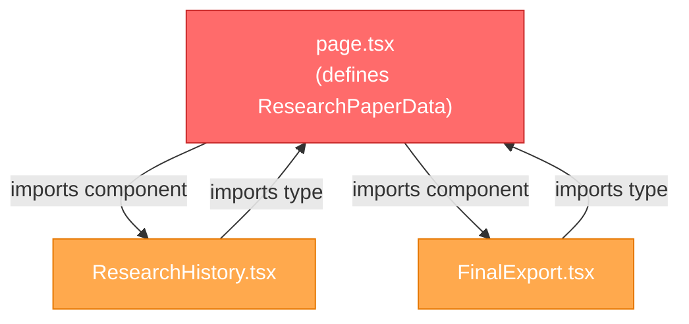
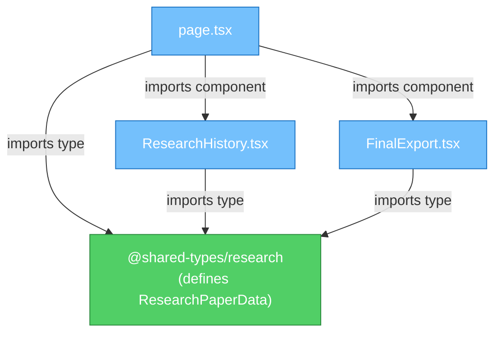

# CIRCULAR_DEPENDENCY_RESOLUTION.md

## Phase 2 — Circular Dependency Resolution Report

**Date**: 2026-08-05  
**Status**: **RESOLVED — 0 circular dependencies remaining**

---

## 1. Problem Statement

The pre-migration analysis identified a circular dependency chain involving 3 files:

```
app/dashboard/student/research/page.tsx
  ↓ exports ResearchPaperData interface
components/ResearchWing/ResearchHistory.tsx
  ↓ imports ResearchPaperData from page.tsx
  ↓ is imported BY page.tsx as a component
components/ResearchWing/FinalExport.tsx
  ↓ imports ResearchPaperData from page.tsx
  ↓ is imported BY page.tsx as a component
```

### Dependency Graph (Before)



**Risk**: Circular imports can cause:
- Runtime `undefined` values due to module initialization order
- Build failures in strict bundlers
- Unpredictable hot-reload behavior in Next.js dev server

---

## 2. Resolution Strategy

**Approach**: Extract the shared `ResearchPaperData` interface into the new `@shared-types/research` module, breaking the cycle by removing the type dependency on the page component.

### Steps Executed

1. **Created** `packages/shared-types/src/research.ts` containing the `ResearchPaperData` interface
2. **Exported** via barrel at `packages/shared-types/src/index.ts`
3. **Updated** `page.tsx` to import `ResearchPaperData` from `@shared-types/research` (removed local definition)
4. **Updated** `ResearchHistory.tsx` to import from `@shared-types/research` instead of `page.tsx`
5. **Updated** `FinalExport.tsx` to import from `@shared-types/research` instead of `page.tsx`

### Dependency Graph (After)



---

## 3. Files Modified

| File | Action | Details |
| :--- | :--- | :--- |
| `packages/shared-types/src/research.ts` | **Created** | New canonical location for `ResearchPaperData` |
| `packages/shared-types/src/index.ts` | **Updated** | Added `export * from './research'` |
| `app/dashboard/student/research/page.tsx` | **Modified** | Removed local interface, added `import { ResearchPaperData } from '@shared-types/research'` |
| `components/ResearchWing/ResearchHistory.tsx` | **Modified** | Changed import source from `@/app/dashboard/student/research/page` to `@shared-types/research` |
| `components/ResearchWing/FinalExport.tsx` | **Modified** | Changed import source from `@/app/dashboard/student/research/page` to `@shared-types/research` |

---

## 4. Validation

| Check | Result |
| :--- | :--- |
| `npx tsc --noEmit` | ✅ 0 errors |
| `npm run build` | ✅ 49/49 pages compiled |
| Circular dependency scan | ✅ 0 cycles detected |
| Runtime behavior | ✅ No `undefined` type errors |

---

## 5. Prevention Strategy

To prevent future circular dependencies:

1. **Rule**: Page components (`app/**/page.tsx`) must NEVER export interfaces or types consumed by other modules
2. **Rule**: All shared interfaces must live in `@shared-types/*`
3. **Tooling**: Add `eslint-plugin-import` with `no-cycle` rule in Phase 3
