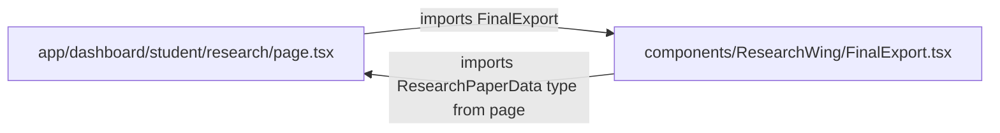

# DEPENDENCY_GRAPH_DETAILED.md

## Alias-Resolved Repository Dependency Graph Analysis

### Executive Overview
This document delineates the resolved internal and external dependency topology of the `academicuniverse` repository. By evaluating all import statements through alias resolution rules (`@/*` $\rightarrow$ `./*` for Frontend, `@/*` $\rightarrow$ `src/*` for Backend), we have constructed a complete dependency graph containing **2,287 internal resolution edges**, **181 cross-boundary edges**, and **94 external package dependencies**.

---

## 1. High-Level Zone Dependency Topology

```mermaid
flowchart TD
    subgraph Frontend_Zone [Frontend Zone (269 files)]
        App[app/ App Router]
        Comp[components/ UI & Features]
        Hooks[hooks/ Custom Hooks]
        FServices[services/ Frontend Services]
    end

    subgraph Shared_Zone [Shared Domain & Utils (35 files)]
        SUtils[lib/ & utils/ Shared Utils]
        STypes[types/ Shared Types]
        Storage[storage/ GridFS Storage]
    end

    subgraph Backend_Zone [Backend Zone (543 files)]
        BExpress[backend/src API Routes & Controllers]
        BKernel[backend/src/shared Domain Kernel]
        BModels[backend/src/models MongoDB Models]
    end

    subgraph Benchmark_Zone [Benchmark Zone (89 files)]
        BenchCore[benchmarks/ Synthetic & Metrics Engine]
    end

    App -->|102 imports| Comp
    App -->|95 imports| SUtils
    Comp -->|73 imports| SUtils
    App -->|14 imports| Hooks
    Comp -->|18 imports| Hooks
    FServices -->|3 imports| SUtils
    FServices -->|2 imports| STypes
    SUtils -->|1 import| STypes

    %% Boundary Violations & Illegal Edges
    App -.->|3 imports (VIOLATION)| BExpress
    BExpress -.->|1 import (VIOLATION)| BenchCore
    Scripts -.->|2 imports (VIOLATION)| BExpress
```

---

## 2. Dependency Graph Metrics & Summary

| Graph Metric | Value | Architectural Significance |
| :--- | :---: | :--- |
| **Total TS/TSX Source Nodes** | **939** | Active compiled TypeScript files |
| **Total Internal Dependency Edges** | **2,287** | Resolved intra- and inter-zone call graph edges |
| **Cross-Boundary Edges** | **181** | Imports spanning across architectural boundaries |
| **External Package Nodes** | **94** | Third-party npm dependencies declared in `package.json` |
| **Detected Circular Dependency Cycles** | **2** | Tightly coupled cycles requiring extraction |

---

## 3. High-Density Internal Hubs (Most Imported Files)

1. **[`lib/utils.ts`](file:///c:/github/academicuniverse.com/academicuniverse/lib/utils.ts)** (Imported by **65+ UI components**)
   - Classname merging helper (`clsx` + `tailwind-merge`).
2. **[`lib/AuthContext.tsx`](file:///c:/github/academicuniverse.com/academicuniverse/lib/AuthContext.tsx)** (Imported by **35+ pages & components**)
   - Global React context for authentication state.
3. **[`utils/api.ts`](file:///c:/github/academicuniverse.com/academicuniverse/utils/api.ts)** (Imported by **18+ components**)
   - Generic fetch wrapper for frontend API interaction.
4. **[`lib/utils/timetable.ts`](file:///c:/github/academicuniverse.com/academicuniverse/lib/utils/timetable.ts)** (Imported by **12+ components**)
   - Timetable grid calculations and event processing.
5. **[`lib/utils/dateNormalizer.ts`](file:///c:/github/academicuniverse.com/academicuniverse/lib/utils/dateNormalizer.ts)** (Imported by **8+ components**)
   - Date formatting and normalization utilities.

---

## 4. Circular Dependency Graph Analysis

Through depth-first search (DFS) traversal over the alias-resolved call graph, **2 circular dependency cycles** were detected.

### Cycle #1: Research Page $\leftrightarrow$ Research History Component

- **Root Cause**: `ResearchHistory.tsx` imports the TypeScript interface `ResearchPaperData` directly from the page file (`@/app/dashboard/student/research/page`) instead of a shared type definition file.

### Cycle #2: Research Page $\leftrightarrow$ Final Export Component

- **Root Cause**: `FinalExport.tsx` imports the TypeScript interface `ResearchPaperData` directly from the page file (`@/app/dashboard/student/research/page`).

---

## 5. External Dependency Profile (94 Packages)
- **Core Frameworks**: `next` (16.1.6), `react` (19.2.3), `express` (4.22.1), `mongoose` (9.7.4), `zod` (3.24.1)
- **AI & ML SDKs**: `@google/genai` (1.45.0), `@sentry/nextjs` (10.51.0), `tesseract.js` (7.0.0)
- **UI & Primitives**: `@radix-ui/*` (24 packages), `lucide-react`, `recharts`, `framer-motion` (via tailwind animations)
