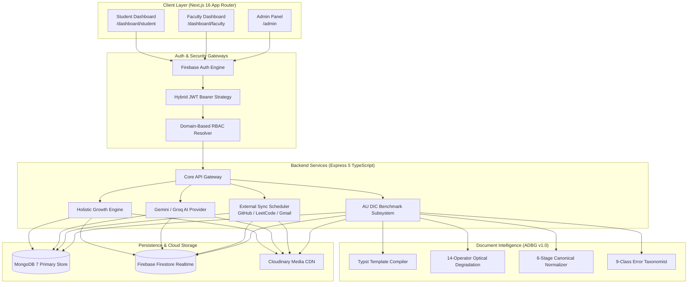

# 🎓 Academic Universe

<div align="center">

  

  # **Academic Universe & AU DIC Benchmark**
  ### *An AI-Powered Student Growth Intelligence Ecosystem & Synthetic Document Intelligence Benchmark Suite*

  [](https://nextjs.org/)
  [](https://www.typescriptlang.org/)
  [](https://expressjs.com/)
  [](https://www.mongodb.com/)
  [](https://firebase.google.com/)
  [](https://tailwindcss.com/)
  [](https://ieeeaccess.ieee.org/)
  [](LICENSE)

  <br />

  [**Overview**](#-overview) •
  [**Key Features**](#-key-features) •
  [**Research Publications**](#-research-publications--academic-benchmarks) •
  [**Architecture**](#-system-architecture) •
  [**Tech Stack**](#-technology-stack) •
  [**Quick Start**](#-getting-started) •
  [**Security & Ethics**](#-security-privacy--ethics)

</div>

---

## 🔬 Research Publications & Academic Benchmarks

> [!IMPORTANT]
> **Research Phase 1 Status**: **COMPLETED & FEATURE FROZEN** ✅  
> Both core research papers have completed scientific validation, 9-task pre-submission quality audits, and formatting for target venues (**IEEE Access** / **ICDAR 2026** and **IEEE TLT**). All artifacts are archived under `docs/paper/` and `docs/reports/`.

| Publication Title | Core Subsystem | Dataset & Code | Target Venue | Status |
| :--- | :--- | :---: | :---: | :---: |
| **Paper 1**: *ADBG v1.0 & AU DIC Benchmark Evaluation Framework: A Reproducible Synthetic Benchmark Suite and Normalization Pipeline for Academic Document Intelligence* | **ADBG v1.0** + **AU DIC Subsystem** | 360 specimens ($5,760$ fields) | **IEEE Access / ICDAR 2026** | **QA CERTIFIED** ✅ |
| **Paper 2**: *Academic Universe: An AI-Powered Holistic Student Growth Intelligence Ecosystem* | **3-Tier Growth Pipeline**, **SIE-1.0**, **GIE** | Multi-tenant SaaS Engine | **IEEE TLT** | **SUBMITTED** 📄 |

### Key Benchmark Discoveries (**ADBG v1.0 & AU DIC Suite**)
- **Seed-Deterministic Fabrication**: Generates pixel-exact academic credentials (marksheets, certificates, student IDs) paired with ground-truth JSON annotations across 4 optical degradation profiles (`clean`, `scanner_copy`, `mobile_camera`, `rotated_90`).
- **6-Stage Canonical Normalizer**: Boosts field extraction accuracy by **+45.49% F1** ($50.00\% \rightarrow 95.49\%$, $p < 0.0001$) and reduces Character Error Rate (CER) by **90.42%** ($38.13\% \rightarrow 3.65\%$) by filtering benign representation variations.
- **9-Class Structured Error Taxonomy**: Categorizes recognition failures into fine-grained diagnostic classes (`OCR_ERROR`, `FIELD_MISSING`, `HALLUCINATION`, `FORMAT_ERROR`, `NORMALIZATION_ERROR`, etc.).
- **Read-Only Benchmark Execution**: Achieves **242.59 samples/sec** throughput with **0 database state mutations**.

---

## ✨ Overview

**Academic Universe** is a Next.js 16 + Express 5 multi-tenant platform designed to transform modern higher education administration. Shifting the focus from simple GPA tracking to **Holistic Student Development**, Academic Universe offers an end-to-end ecosystem integrating **IQ/EQ analytics**, **AI-driven emotional intelligence assistance**, **verified professional credential tracking**, and **privacy-preserving document intelligence**.

Built with a **Glassmorphism UI System**, **Turbopack HMR**, and **Zero-Flicker Hydration**, the application provides a desktop-grade experience for students, faculty members, and institutional administrators.

---

## 🚀 Key Features

```
┌───────────────────────────────────────────────────────────────────────────────────────────────────┐
│                                   ACADEMIC UNIVERSE ECOSYSTEM                                     │
├───────────────────────────────┬───────────────────────────────┬───────────────────────────────────┤
│   🧠 Holistic Growth Engine   │      🤖 AI-First Wing         │    ✅ Verified Record System      │
├───────────────────────────────┼───────────────────────────────┼───────────────────────────────────┤
│ • Weekly IQ/EQ Assessments    │ • Gemini 2.5-Flash EI Chatbot │ • Faculty-Verified Portfolios     │
│ • Burnout & Stress Detection  │ • Research Paper Finalizer    │ • GitHub, LeetCode, Codeforces    │
│ • Trend Line Visualization    │ • Career Advice Generator     │ • Gmail Event Auto-Sync           │
│ • Proactive Growth Alerts     │ • Smart Course Recommender    │ • ADBG Document Intelligence      │
└───────────────────────────────┴───────────────────────────────┴───────────────────────────────────┘
```

### 🧠 **Holistic Growth Engine (IQ/EQ Analytics)**
- **Multi-Dimensional Metrics**: Evaluates cognitive skills, emotional intelligence, resilience, and academic performance.
- **Wellness Monitoring**: Automated burnout detection algorithms alerting advisors to cognitive stress.
- **Progress Tracking**: Interactive Recharts analytics tracking student milestones over multi-semester timelines.

### 🤖 **AI-Powered Assistance**
- **Emotional Intelligence Chatbot**: 24/7 empathetic assistant built on Google Gemini 2.5 Flash and Groq Cloud Llama 3.1 8B Instant.
- **Automated Research Wing**: End-to-end assistant for thesis outline generation, literature synthesis, and IEEE/Springer formatting.
- **Career Recommender**: Data-driven job role recommendations based on verified skill trees and coding activity.

### ✅ **Verified Credential & Document Intelligence (AU DIC)**
- **ADBG v1.0 Generator**: Fictional credential generation eliminating FERPA/GDPR privacy risks.
- **Automated Verification**: Read-only extraction pipeline testing OCR and Vision-Language models on academic transcripts.
- **Real-Time Developer Sync**: Automated background sync for GitHub commits, LeetCode submissions, and Codeforces ratings.
- **Gmail Hackathon Extractor**: AI parsing of academic emails to extract competition invites and hackathons automatically.

### 🏢 **Enterprise SaaS Architecture**
- **Domain-Based RBAC**: Automatic role resolution based on institutional email domains (`@ug.sharda.ac.in` $\rightarrow$ **STUDENT**, `@fa.sharda.ac.in` $\rightarrow$ **FACULTY**).
- **Multi-Tenant Data Isolation**: Complete tenant boundary enforcement at the database layer.
- **Timetable Overlap Engine**: Conflict detection algorithms for scheduling multi-section university courses.

---

## 🏗️ System Architecture



---

## 🛠️ Technology Stack

| Domain | Technologies |
| :--- | :--- |
| **Frontend Framework** | **Next.js 16.1.6** (App Router, Turbopack), **React 19**, **TypeScript 5.7** |
| **Styling & Design System** | **Tailwind CSS 4.0**, **Radix UI**, Lucide Icons, Glassmorphism CSS |
| **Data Visualization** | **Recharts**, Mermaid.js Diagrams |
| **Backend Runtime** | **Node.js 20+**, **Express 5.0**, TypeScript ESM |
| **Databases** | **MongoDB 7.0** (Mongoose ODM), **Firebase Firestore** (Real-time sync) |
| **Authentication** | **Firebase Auth**, Hybrid JWT Bearer Middleware, Domain-Enforced RBAC |
| **AI Providers** | **Google Gemini API** (`gemini-2.5-flash`), **Groq Cloud** (`llama-3.1-8b-instant`), **Sentry** |
| **Document Processing** | **Typst Compiler**, **PDF-Lib**, **Tesseract.js**, **Sharp Image Engine**, **PDFjs-Dist** |
| **Deployment Targets** | **Vercel** (Frontend Next.js App), **Railway** / **Docker** (Backend API Engine) |

---

## 🎯 Domain-Enforced Role Matrix

Role permissions are strictly locked to verified email domain patterns:

| Domain Pattern | Assigned Role | Primary Landing Route | Granted Permissions |
| :--- | :---: | :---: | :--- |
| `@ug.sharda.ac.in` | **`STUDENT`** | `/dashboard/student` | Profile, IQ/EQ analytics, Document Intelligence, Career, Resume Builder, Mail |
| `@fa.sharda.ac.in` | **`FACULTY`** | `/dashboard/faculty` | Student verification, Analytics, Research Wing, Grades, Course management |
| `@academicuniverse.com` | **`SUPER_ADMIN`** | `/admin` | Timetable status, Section management, User assignment, Module configuration |

---

## 🚦 Getting Started

### 1. Prerequisites
- **Node.js**: `v20.0.0` or higher
- **Package Manager**: `npm` (v10+)
- **MongoDB**: Local instance or MongoDB Atlas URI
- **Firebase Project**: Admin Service Account credentials

### 2. Repository Setup

```bash
# Clone the repository
git clone https://github.com/aashishrajput9838/academicuniverse.git
cd academicuniverse

# Install frontend and root dependencies
npm install

# Install backend dependencies
cd backend
npm install
cd ..
```

### 3. Environment Variables

Create `.env.local` in the project root:
```env
NEXT_PUBLIC_API_BASE_URL=http://localhost:5000/api
NEXT_PUBLIC_FIREBASE_API_KEY=your_firebase_api_key
NEXT_PUBLIC_FIREBASE_AUTH_DOMAIN=your_project.firebaseapp.com
NEXT_PUBLIC_FIREBASE_PROJECT_ID=your_project_id
```

Create `.env` inside `backend/`:
```env
PORT=5000
MONGODB_URI=mongodb://localhost:27017/academicuniverse
JWT_SECRET=your_jwt_super_secret_key
GEMINI_API_KEY=your_google_gemini_api_key
GROQ_API_KEY=your_groq_api_key
```

### 4. Database Seeding & Launch

```bash
# Seed initial database roles & organization structures
cd backend
npm run seed
cd ..

# Launch development environment (Frontend Next.js + Backend Express)
# On Windows PowerShell:
./start-dev.ps1

# Or run individually:
npm run dev               # Next.js (port 3000)
cd backend && npm run dev # Express (port 5000)
```

---

## 🧪 Running Benchmarks & Verification

```bash
# Run ADBG v1.0 Synthetic Document Generator
cd backend
npm run benchmark:generate

# Execute AU DIC Evaluation Pipeline across 360 specimens
npm run benchmark:evaluate

# Execute 2-Pass Canonical Normalization Ablation Study
npm run benchmark:ablation

# Run complete TypeScript build check
npm run build
```

---

## 🛡️ Security, Privacy & Ethics Compliance

- **FERPA & GDPR Compliance**: Uses seed-deterministic synthetic credentials (ADBG v1.0) so zero authentic student records or PII are exposed.
- **Tenant Data Isolation**: Multi-tenant database boundary checks enforced on every MongoDB query by `organizationId`.
- **AES-256 Encryption at Rest**: Sensitive tokens (GitHub OAuth, Gmail API tokens) are encrypted prior to database storage.
- **Read-Only Benchmark Isolation**: The AU DIC evaluation engine operates strictly in read-only mode (`isReadOnly: true`) with **zero production database mutations**.

---

## 📂 Repository Structure

```
academicuniverse/
├── app/                        # Next.js 16 App Router (Pages, API Routes, Layouts)
│   ├── (auth)/                 # Login & Registration flows
│   ├── admin/                  # Super Admin management dashboards
│   ├── api/                    # Serverless Next.js API endpoints
│   └── dashboard/              # Student & Faculty dashboards
├── backend/                    # Express 5 Backend Core Service
│   ├── src/
│   │   ├── benchmark/          # ADBG v1.0 & AU DIC Evaluation Subsystem
│   │   ├── config/             # Database & Firebase configuration
│   │   ├── controllers/        # API Request controllers
│   │   ├── core/ai/            # Gemini, Groq, OpenRouter AI Providers
│   │   ├── models/             # Mongoose schemas (User, Student, Faculty, Growth)
│   │   ├── routes/             # Express API routes
│   │   └── services/           # Business logic & background sync engines
├── benchmarks/                 # Synthetic generator templates & dataset manager
├── components/                 # Reusable React UI components (Radix UI, Glassmorphism)
├── docs/                       # Publication manuscripts, reports, and QA audits
│   ├── paper/                  # Camera-ready IEEE Access DOCX build artifacts
│   └── reports/                # Reference audit, citation validation, QA checklists
├── public/                     # Static branding assets & logos
├── .vercelignore               # Vercel deployment bundle optimization rules
├── next.config.mjs             # Next.js configuration & server external packages
└── README.md                   # Project documentation
```

---

## 📜 Citation & License

If you use **Academic Universe**, **ADBG v1.0**, or the **AU DIC Benchmark Suite** in your research, please cite our manuscript:

```bibtex
@article{rajput2026adbg,
  title={ADBG v1.0 \& AU DIC Benchmark Evaluation Framework: A Reproducible Synthetic Benchmark Suite and Normalization Pipeline for Academic Document Intelligence},
  author={AU DIC Research Team},
  journal={IEEE Access},
  year={2026},
  publisher={IEEE}
}
```

Distributed under the **MIT License**. See [`LICENSE`](LICENSE) for details.

---

<div align="center">
  <sub>Built with ❤️ by the <b>AU DIC Research Team</b> for the next generation of higher education.</sub>
</div>
