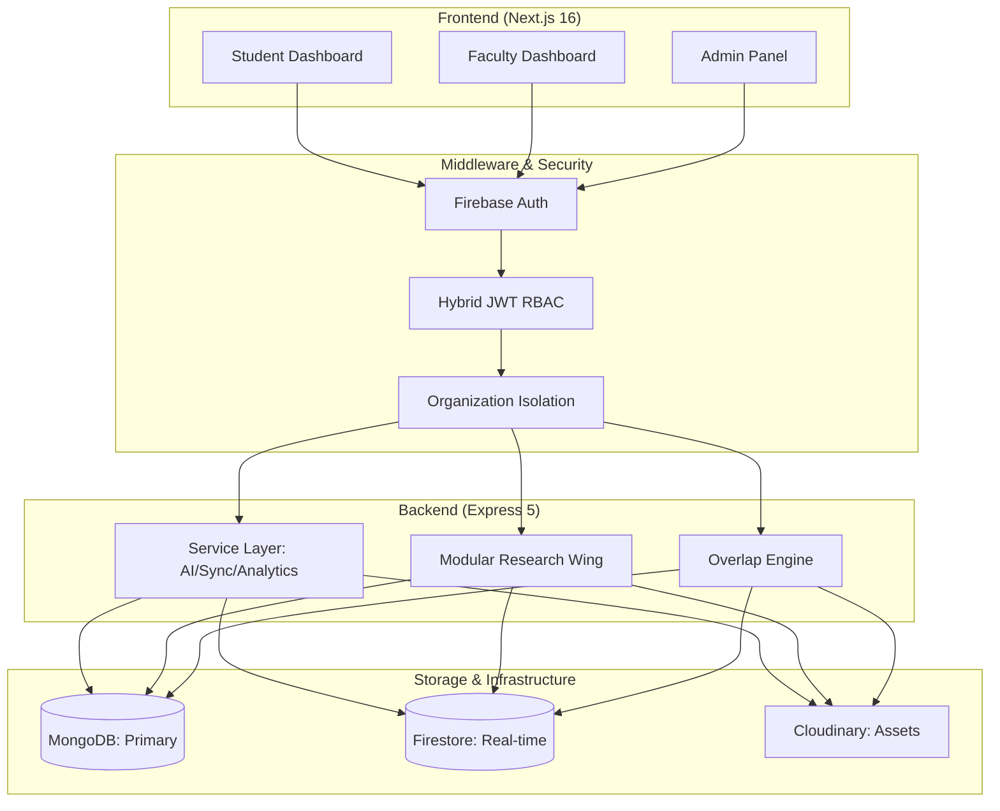

# 🎓 Academic Universe

<div align="center">
  
  <br />
  <h3><b>The First AI-Powered Student Growth Ecosystem</b></h3>
  <p><i>Beyond Marks & Attendance: Transforming Education Through Holistic Development</i></p>

  <div>
    
    
    
    
    
  </div>
  <br />
  <div>
    
    
    
    
  </div>
</div>

---

## ✨ Overview

Academic Universe is a high-performance, multi-tenant SaaS platform designed to modernize the educational experience. By shifting the focus from mere grades to **Holistic Student Development**, it provides a unified ecosystem for IQ/EQ tracking, mental wellness, and verified professional achievements.

Built with a **Glassmorphism UI** and **Zero-Flicker Hydration**, the platform offers a premium, desktop-grade experience for students and faculty alike.

---

## 🚀 Core Pillars

### 🧠 **Holistic Growth Engine**
- **IQ/EQ Analytics**: Weekly cognitive and emotional assessments with trend visualization.
- **Wellness Tracking**: AI-powered burnout detection and stress monitoring.
- **Growth Alerts**: Proactive notifications for performance degradation.

### 🤖 **AI-First Support**
- **EI Chatbot**: 24/7 empathetic assistant powered by Google Gemini (2.5-flash).
- **Research Wing**: End-to-end AI support for topic generation, content writing, and paper finalization.
- **Smart Recommendations**: Tailored academic and career advice based on real-time data.

### ✅ **Verified Record System**
- **Faculty-Verified Portfolio**: A trusted source of truth for recruiters, replacing scattered forms.
- **External Integration**: Automatic syncing of GitHub contributions, LeetCode progress, and Codeforces rankings.
- **Gmail Event Detector**: AI-powered extraction of hackathons and tech events from student emails.

### 🏢 **Enterprise-Grade Architecture**
- **Multi-Tenancy**: Complete data isolation between organizations.
- **Domain-Based RBAC**: Automatic role assignment (e.g., `@ug.sharda.ac.in` → **STUDENT**).
- **Overlap Engine**: Intelligent conflict detection for multi-section event scheduling.

---

## 🏗️ System Architecture



---

## 🛠️ Technical Stack

### **Frontend Ecosystem**
- **Framework**: Next.js 16 (App Router, Turbopack)
- **UI Architecture**: React 19, Tailwind CSS 4, Radix UI Primitives
- **Data Viz**: Recharts (High-performance analytics)
- **Form Management**: React Hook Form + Zod Validation

### **Backend & Data**
- **Runtime**: Node.js + Express 5 (TypeScript)
- **Primary DB**: MongoDB 7 (Mongoose ODM)
- **Real-time DB**: Firebase Firestore (Security Rules enforced)
- **Auth**: Hybrid Firebase SDK + Custom JWT Bearer Strategy

### **AI & Intelligence**
- **Engine**: Google Gemini API (gemini-2.5-flash)
- **Automation**: Node-Cron Schedulers (6h sync cycles for GitHub/Gmail)
- **Observability**: Winston Logger + Sentry Full-Stack Tracking

---

## 🎯 Automatic Role Assignment

Role assignment is strictly domain-enforced and cannot be manually altered, ensuring system integrity.

| Domain | Assigned Role | Primary Dashboard |
| :--- | :--- | :--- |
| `@ug.sharda.ac.in` | **STUDENT** | `/dashboard/student` |
| `@fa.sharda.ac.in` | **FACULTY** | `/dashboard/faculty` |
| `@academicuniverse.com` | **SUPER_ADMIN** | `/admin` |

---

## 🚦 Getting Started

### 1. Prerequisites
- Node.js v20+
- MongoDB Instance
- Firebase Project with Service Account

### 2. Environment Configuration
Create a `.env` in the `/backend` and `.env.local` in the root. Refer to [DEVELOPMENT_SETUP.md](./DEVELOPMENT_SETUP.md) for full key requirements.

### 3. Installation & Boot
```bash
# Install dependencies
npm run install-all

# Seed initial roles and organizations
cd backend && npm run seed

# Launch both servers (using the provided script)
./start-dev.ps1
```

---

## 🛡️ Security & Performance
- **CSP Compliance**: Strict Content Security Policy for all scripts and styles.
- **Data Isolation**: All MongoDB queries are automatically filtered by `organizationId`.
- **Token Security**: GitHub and Gmail tokens are encrypted at rest using AES-256.
- **Monitoring**: Real-time error tracking with Sentry and unique Request-ID tracing.

---

## 📄 License
Distributed under the **MIT License**. See `LICENSE` for more information.

<div align="center">
  <p>Built with ❤️ for the next generation of students.</p>
</div>
