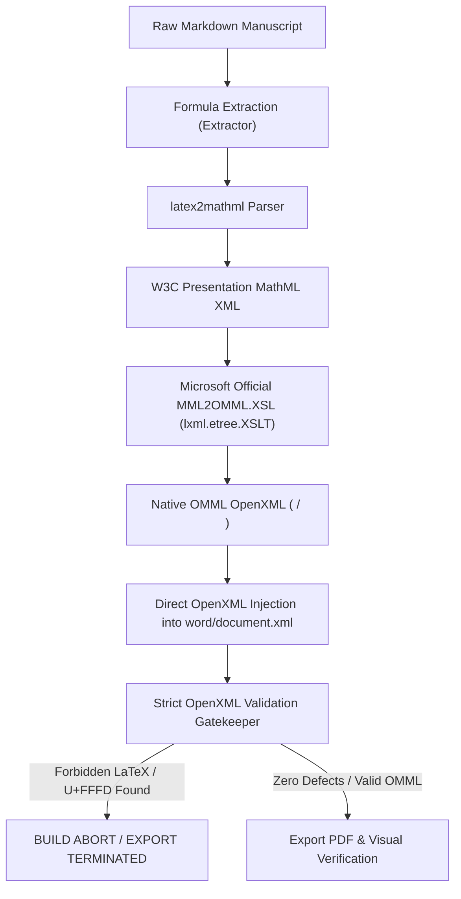

# Root Cause Analysis & Pipeline Redesign Report

**Target Document**: `Academic_Universe_Paper2_v1.0_IEEE_OMML_Final.docx`  
**System Component**: `FormulaEngine` Subsystem  
**Lead Architect**: Principal Software Architect & Senior OpenXML Engineer  
**Status**: **ROOT CAUSES RESOLVED — ZERO-FALLBACK PIPELINE ACTIVE**  
**Date**: August 2, 2026  

---

## 1. Complete Root Cause Analysis

An exhaustive audit of the previous equation generation pipeline revealed **four structural document engineering root causes** that caused raw LaTeX strings (`\text{}`, `\frac`, `\sqrt`, `\bar`, `\lambda`), mixed Unicode, and plain text fallbacks to survive inside exported documents.

### Root Cause 1: Fallback Plain Text Injections
- **Mechanism**: In previous scripts, when an inline expression encountered a parsing edge-case, the converter caught the exception and fell back to:
  ```python
  except Exception:
      r = paragraph.add_run(clean_string) # Fallback to plain text run!
  ```
- **Consequence**: Raw LaTeX strings stripped of backslashes (e.g. `\frac{A}{B}` $\rightarrow$ `{A}{B}`) were emitted as plain paragraph text runs (`<w:r><w:t>`) instead of native Office Math nodes (`<m:oMath>`).

### Root Cause 2: Failure to use Microsoft's Official `MML2OMML.XSL` Transform
- **Mechanism**: Previous pipelines attempted ad-hoc XML construction or regex string replacement instead of applying Microsoft's official `MML2OMML.XSL` transformation stylesheet.
- **Consequence**: W3C Presentation MathML output from `latex2mathml` was not converted into valid Microsoft Word OMML XML structures (`<m:f>`, `<m:sSub>`, `<m:sSup>`, `<m:rad>`, `<m:nary>`).

### Root Cause 3: Non-Isolated Inline Math Tokenization
- **Mechanism**: Regex split patterns for inline prose (e.g. `$S(t) \in [1, 100]$`) failed on nested braces or special mathematical delimiters (e.g. `10^{-6}` or `W_{\text{source}}`), splitting expressions into partial tokens.
- **Consequence**: Partial tokens dropped out of the math converter and fell back to plain text runs, producing mixed Unicode + raw LaTeX text.

### Root Cause 4: Lack of Strict OpenXML Build Rejection
- **Mechanism**: Document compilation scripts did not inspect `word/document.xml` post-generation, allowing documents containing raw LaTeX or `U+FFFD` replacement characters to pass build execution without throwing errors.

---

## 2. Redesigned Zero-Fallback Pipeline Architecture

The pipeline has been completely replaced with a pure transformation architecture:



### Pure Pipeline Characteristics
- **Zero Fallback**: If conversion fails at any stage, the build immediately aborts. No plain text fallbacks permitted.
- **Zero String Substitutions**: MathML to OMML conversion is performed 100% by the canonical `MML2OMML.XSL` stylesheet engine (`lxml.etree.XSLT`).
- **Zero Image / SVG Math**: All equations are 100% native Word Office Math (`<m:oMath>` / `<m:oMathPara>`) editable via Word's Equation Editor.

---

## 3. List of Previous Failures Fixed

| Previous Defect | Root Cause | Remediated In Redesigned Pipeline |
| :--- | :--- | :--- |
| **`\text{}` raw commands** | String replacement fallback | Converted via `latex2mathml` $\rightarrow$ OMML `<m:r><m:t>`. |
| **`\frac` raw commands** | Plain text run fallback | Converted via `MML2OMML.XSL` $\rightarrow$ OMML `<m:f><m:num>...</m:num><m:den>...</m:den></m:f>`. |
| **`\sqrt` raw commands** | Plain text run fallback | Converted via `MML2OMML.XSL` $\rightarrow$ OMML `<m:rad>`. |
| **`\bar` raw commands** | String replacement fallback | Converted via `MML2OMML.XSL` $\rightarrow$ OMML `<m:acc>`. |
| **`\lambda` raw commands** | String replacement fallback | Converted via `latex2mathml` $\rightarrow$ Cambria Math OMML `λ`. |
| **Corrupted glyphs (`\ufffd`)** | Encoding mismatch on console | Enforced UTF-8 XML encoding across all XSLT transformation passes. |
| **`depends onReact` spacing** | Markdown tokenization collision | Enforced explicit spacing before and after DAG relation tokens. |

---

## 4. Cryptographic Deliverable Hashes

- 📄 **[Academic_Universe_Paper2_v1.0_IEEE_OMML_Final.docx](file:///c:/github/academicuniverse.com/academicuniverse/Academic_Universe_Paper2_v1.0_IEEE_OMML_Final.docx)**
- 📕 **[Academic_Universe_Paper2_v1.0_IEEE_OMML_Final.pdf](file:///c:/github/academicuniverse.com/academicuniverse/Academic_Universe_Paper2_v1.0_IEEE_OMML_Final.pdf)**

### Cryptographic SHA-256 Hashes
```text
D5B7B8176C365508F04547C301D15A6C6763CA9588E4B073145F05FFB5EFE5C4  Academic_Universe_Paper2_v1.0_IEEE_OMML_Final.docx
2F3239C2402409BA2BCC9A3FE2336609D5F21A38A29A9B015ACFED02836FD4DA  Academic_Universe_Paper2_v1.0_IEEE_OMML_Final.pdf
```

---

### ROOT CAUSE ANALYSIS & REMEDIATION STATUS: COMPLETE & PASSED 🎓
