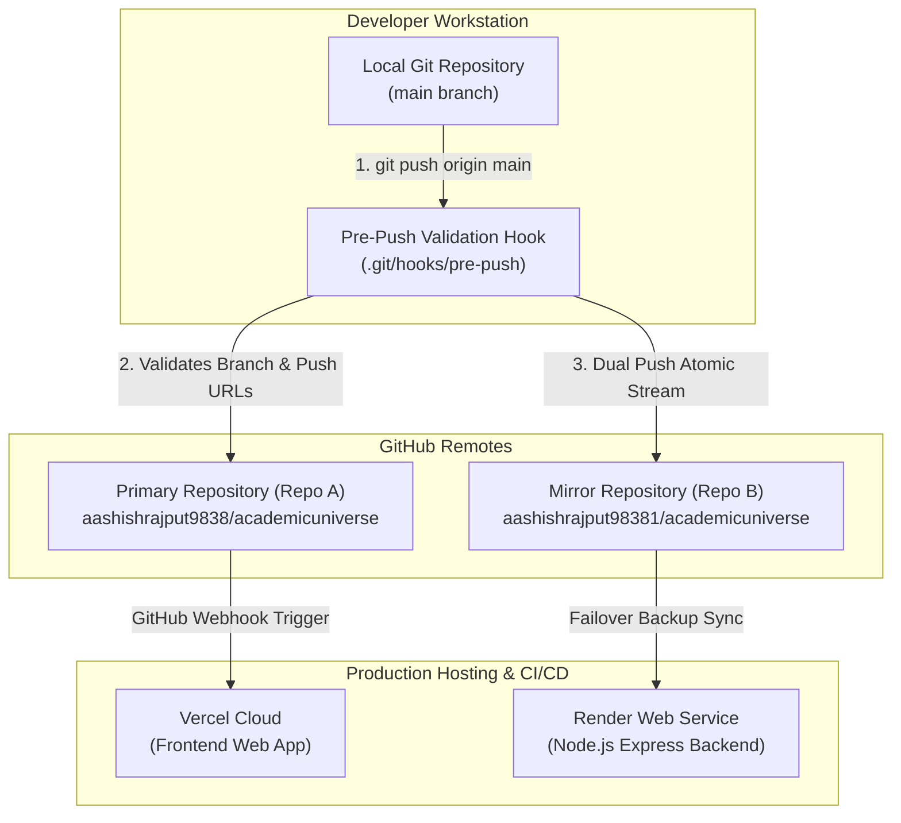

# Dual Git Repository Synchronization & Architecture Guide

**Project**: Academic Universe  
**Author**: Lead Software Architect & Principal DevOps Engineer  
**Version**: 1.0 Production Standard  

---

## 1. Architecture Overview

Academic Universe uses a **High-Availability Dual-Push Repository Architecture**. Local developer workstations push simultaneously to both a **Primary Repository** and a **Mirror Repository** in a single `git push` invocation.



---

## 2. Primary vs Mirror Repositories

| Attribute | Primary Repository (Repo A) | Mirror Repository (Repo B) |
| :--- | :--- | :--- |
| **GitHub URI** | `https://github.com/aashishrajput9838/academicuniverse.git` | `https://github.com/aashishrajput98381/academicuniverse.git` |
| **Fetch Role** | Primary Source of Truth (`fetch`) | Failover Backup Source |
| **Push Role** | Dual-Push Target 1 | Dual-Push Target 2 |
| **CI/CD Integrations** | Vercel, Render, Sentry, Codecov | Standby CI/CD Mirror |
| **Access Policy** | Write Access Required | Collaborator / Write Access Required |

---

## 3. Disaster Recovery & Failover Strategy

### Scenario A: Primary Repository Outage or Deletion
1. Switch local `fetch` URL to point to Mirror Repository:
   ```bash
   git remote set-url origin https://github.com/aashishrajput98381/academicuniverse.git
   ```
2. Verify local repository state against Mirror:
   ```powershell
   .\scripts\verify-git-sync.ps1
   ```
3. Continue development uninterrupted.

### Scenario B: Desynchronization Between Remotes
If commit hashes between Repo A and Repo B differ due to network interruptions:
1. Run automated verification:
   ```powershell
   .\scripts\verify-git-sync.ps1
   ```
2. Force-align mirror repository to match primary:
   ```bash
   git push --force origin main
   ```

---

## 4. Developer Workflow Guidelines

### DO
- **ALWAYS** use `.\scripts\git-sync.ps1` for pushing code to ensure post-push commit hash verification.
- **ALWAYS** run `.\scripts\git-health.ps1` before starting critical release sprints.
- Keep `main` as the default development and production tracking branch.

### DON'T
- **DO NOT** modify push URLs manually without re-running `.\scripts\verify-git-sync.ps1`.
- **DO NOT** force push to a single remote independently (e.g., `git push https://github.com/...`).
- **DO NOT** commit unencrypted API keys or production certificates (`.env`, `serviceAccountKey.json`).

---

## 5. Adding Another Mirror Repository

To extend dual push to a tertiary mirror (e.g., GitLab, AWS CodeCommit, or 3rd GitHub mirror):

1. Add the push URL to `origin`:
   ```bash
   git remote set-url --add --push origin https://github.com/your-org/academicuniverse-mirror3.git
   ```
2. Verify updated push configuration:
   ```bash
   git remote -v
   ```
3. Update `scripts/verify-git-sync.ps1` and `scripts/git-health.ps1` to include the tertiary URI in validation arrays.

---

## 6. Credential & Authentication Troubleshooting

### Issue 1: `Repository not found` or `Authentication failed`
**Root Cause**: GitHub Personal Access Token (PAT) expired, or collaborator invite was pending.
**Resolution**:
1. Check collaborator status on both GitHub repositories.
2. Update Windows Credential Manager:
   ```powershell
   cmdkey /generic:git:https://github.com /user:aashishrajput9838 /pass:<YOUR_GITHUB_TOKEN>
   ```

### Issue 2: `Non-fast-forward (fetch first)`
**Root Cause**: Remote branch has commits not present locally.
**Resolution**:
```bash
git fetch origin main
git rebase origin/main
.\scripts\git-sync.ps1 -Message "fix: resolved fast-forward merge"
```

### Issue 3: `Remote rejected (pre-receive hook declined)`
**Root Cause**: Commit contains files larger than 100MB or forbidden secret signatures.
**Resolution**:
1. Inspect rejected commit payload.
2. Use `git rm --cached <file>` or Git LFS to process large binaries.
