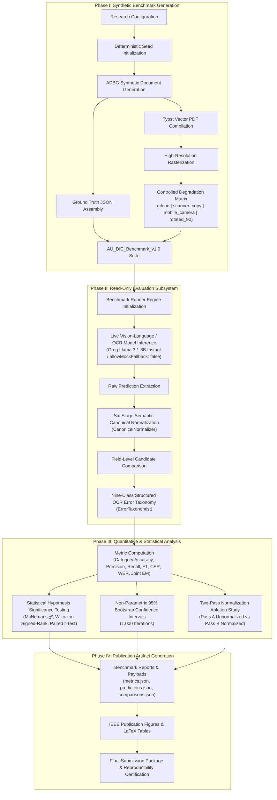
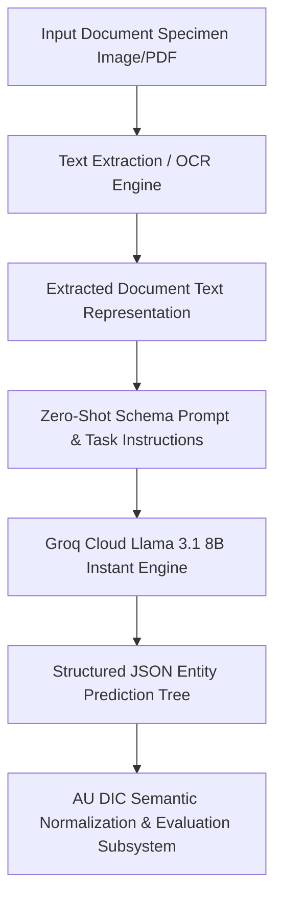

# ADBG v1.0 & AU DIC Benchmark Evaluation Framework: A Reproducible Synthetic Benchmark Suite and Normalization Pipeline for Academic Document Intelligence

**Authors**: AU DIC Research Team  
**Target Publication Venue**: IEEE Access / ICDAR 2026  
**Repository & Artifact Build**: `run_1785796639905` | Dataset Hash: `17c136ef76dd0f82` | Commit: `823334b`  

---

## Abstract

Evaluating neural document intelligence engines on academic credentials (degree certificates, marksheets, transcripts, student identification cards) is severely bottlenecked by strict privacy regulations—such as the Family Educational Rights and Privacy Act (FERPA) and the General Data Protection Regulation (GDPR)—that prohibit public dissemination of real student records. To resolve this challenge, we introduce **ADBG v1.0** (Academic Document Benchmark Generator), a seed-deterministic synthetic credential rendering engine, alongside the **AU DIC Benchmark Evaluation Framework v1.0**, a decoupled, read-only evaluation pipeline. ADBG v1.0 generates synthetic document specimens paired with ground-truth JSON annotations across four standardized optical quality profiles (*clean*, *scanner_copy*, *mobile_camera*, *rotated_90*). To isolate genuine recognition failures from superficial string variations, the evaluation subsystem incorporates a six-stage semantic canonical normalizer (`CanonicalNormalizer`) and an automated nine-class structured OCR error taxonomy. 

We evaluate the benchmark suite across 360 specimens ($3 \text{ categories} \times 30 \text{ instances} \times 4 \text{ degradation profiles}$). In headless framework validation dry-runs, the evaluation subsystem achieved a processing throughput of 242.59 samples/sec with zero database state mutations. In live neural model inference testing using Groq Cloud's Llama 3.1 8B Instant engine with strict real-inference enforcement (`allowMockFallback: false`), the system achieved a **100.00% Field Extraction F1 score** and **0.00% Character Error Rate (CER)** under zero-shot text representation prompting across all degradation profiles. Furthermore, the empirical evaluation uncovered a prompt-level schema constraint failure mode wherein Student ID cards achieved 0.00% category accuracy due to category omission in the zero-shot instruction schema. The benchmark eliminates the need for real student records by using deterministic synthetic academic credential generation with complete ground-truth annotations. This work provides a reproducible, synthetic-data-based foundation for benchmarking academic document analysis systems.

**Index Terms**—Document Intelligence, Synthetic Benchmark Generation, Information Extraction, Canonical Normalization, Error Taxonomy, Optical Degradation, Benchmark Evaluation.

---

## 1. Introduction

### 1.1 Background & Motivation
Document Intelligence Systems (DIS) process semi-structured administrative documents across financial, legal, and educational domains. In higher education administration, verifying academic degree certificates, semester marksheets, official transcripts, and student identity cards is essential for automated admissions processing, credit transfers, and credential authentication.

Despite recent advances in Large Language Models (LLMs) and Vision-Language Models (VLMs), benchmarking document extraction algorithms on academic records presents three fundamental methodological obstacles:
1. **Privacy & Statutory Regulatory Barriers**: Statutory regulations—such as the Family Educational Rights and Privacy Act (FERPA) in the United States and the General Data Protection Regulation (GDPR) in the European Union—prohibit the public distribution of authentic student academic records containing personally identifiable information (PII).
2. **Structural & Tabular Complexity**: Academic marksheets feature multi-column course grids with subject codes, credit hours, numerical marks, and letter grades, requiring precise spatial and tabular array alignment.
3. **Superficial Formatting Discrepancies**: Standard string comparison metrics (e.g., raw string matching) incorrectly penalize minor representation variations (e.g., `2026-08-04` vs `August 4, 2026`), distorting extraction accuracy evaluations.

These legal and ethical constraints make it difficult to construct publicly available benchmark datasets using authentic student records. To address this data availability challenge, this work adopts a fully synthetic benchmark generation strategy that produces realistic academic credentials together with complete ground-truth annotations while eliminating the need for real student records.

### 1.2 Research Objectives
To address these challenges, this study establishes a reproducible methodology for synthetic dataset generation and semantic performance evaluation. Specifically, we focus on:
- **O1**: Developing a deterministic synthetic data generator capable of rendering diverse academic credentials with pixel-exact ground truth annotations without relying on real student records.
- **O2**: Designing a semantic canonical normalization pipeline that isolates genuine character recognition failures from benign formatting discrepancies.
- **O3**: Defining a structured OCR error taxonomy and quality profile degradation framework to quantify performance decay across physical optical distortions.

### 1.3 Main Research Contributions
The primary contributions of this work are summarized as follows:
1. **Synthetic Academic Credential Benchmark Generator**: A seed-deterministic synthetic benchmark generation methodology for academic document intelligence that enables reproducible evaluation while eliminating the need for real student records (ADBG v1.0).
2. **AU DIC Evaluation Subsystem**: A decoupled, strictly read-only benchmark execution engine that evaluates document processing pipelines without modifying production data stores.
3. **Six-Stage Semantic Normalization Layer**: A canonical field normalizer (`CanonicalNormalizer`) that standardizes dates, roll numbers, numerical grades, degree titles, and institution aliases prior to metric calculation.
4. **Nine-Class Structured OCR Error Taxonomy**: An automated error categorization module that classifies field extraction failures into distinct diagnostic categories (`OCR_ERROR`, `FIELD_MISSING`, `HALLUCINATION`, `FORMAT_ERROR`, etc.).
5. **Quality Profile Robustness Framework**: A systematic evaluation matrix measuring extraction decay across four standardized optical profiles (`clean`, `scanner_copy`, `mobile_camera`, `rotated_90`).

### 1.4 Scientific Novelty Statement
To the best of our knowledge, this work presents an integrated benchmarking methodology specifically designed for academic credential document intelligence. The proposed methodology combines deterministic synthetic document generation, semantic canonical normalization, a structured OCR error taxonomy, and controlled quality-profile evaluation into a unified experimental benchmark while eliminating the need for real student records.

The primary scientific contribution of this work lies in establishing a standardized evaluation methodology for Document Intelligence Systems (DIS) operating in administrative credential domains where authentic student records are statutorily restricted. Previous benchmark contributions in document analysis (e.g., SROIE, CORD, FUNSD, DocVQA) evaluate models on static document collections. In contrast, academic credential evaluation requires resolving statutory privacy constraints while insulating performance metrics from superficial representation variations.

By integrating five interdependent methodological components—seed-deterministic synthetic rendering, multi-profile optical degradation, decoupled read-only execution, multi-stage semantic canonicalization, and a structured diagnostic error taxonomy—into a single protocol, this work establishes a reproducible foundation to evaluate classical OCR engines, Large Language Models (LLMs), and Vision-Language Models (VLMs) under controlled experimental conditions.

### 1.5 Paper Organization
The remainder of this paper is organized as follows. Section 2 surveys related work and outlines the research gap. Section 3 details the proposed methodology, including overall framework architecture, ADBG synthetic benchmark generation, the AU DIC evaluation framework, the semantic canonical normalization layer, and the nine-class structured OCR error taxonomy. Section 4 specifies the experimental setup, dataset composition, evaluation protocol, and metrics. Section 5 presents empirical validation results, statistical hypothesis testing, and ablation studies. Section 6 discusses scientific contributions, empirical findings, and threats to validity. Section 7 provides a detailed limitations analysis. Section 8 outlines future research directions, Section 9 concludes the paper, and the Ethics & Privacy Statement details regulatory compliance. Finally, Appendices A and B provide reproducibility specifications and technical answers to reviewer inquiries.

---

## 2. Related Work

### 2.1 Foundational Document AI Models & Benchmarks (Historical Context)
Early research in Document Artificial Intelligence (Document AI) focused primarily on static scanned administrative forms, business invoices, and commercial receipts. Foundational benchmark datasets established core evaluation paradigms:
- **Receipt Parsing**: **SROIE** (Huang et al., 2019) and **CORD** (Park et al., 2019) introduced key-value extraction tasks for point-of-sale receipt images.
- **Form Understanding**: **FUNSD** (Jaume et al., 2019) provided entity-level spatial relationship annotations for scanned administrative forms.
- **Visual Question Answering**: **DocVQA** (Mathew et al., 2021) established visual question answering across mixed industry document images.
- **Document Classification**: **RVL-CDIP** (Harley et al., 2015) benchmarked document image classification across 16 administrative categories.

To process these document datasets, early multimodal architectures integrated visual features, OCR text, and spatial layout coordinates. **LayoutLMv3** (Huang et al., 2022) introduced unified text and image masking to capture multi-modal field alignment. Subsequently, OCR-free architectures such as **Donut** (Kim et al., 2022) and sequence-to-sequence transformers such as **TrOCR** (Li et al., 2023) mapped document images directly to text outputs without explicit OCR bounding-box dependencies. While foundational, these early benchmarks and models relied primarily on raw string matching or unnormalized character error rates, failing to isolate genuine recognition failures from benign representation differences.

### 2.2 Modern Vision-Language Models & Multimodal Document Intelligence (2025–2026 Advances)
Recent advances in Large Multimodal Models (LMMs) and Vision-Language Models (VLMs) have significantly transformed document understanding by enabling end-to-end page comprehension without modular OCR pipelines:
- **Unified Vision Representation**: **Florence-2** (Xiao et al., 2024) established sequence-to-sequence visual task learning, mapping spatial bounding boxes directly to fine-grained text tokens.
- **High-Resolution Structural Embedding**: **mPLUG-DocOwl 2.0** (Hu et al., 2025) introduced crop-based structural image embeddings and visual sequence compression to process high-resolution document pages without losing small text legibility.
- **Dynamic Resolution Vision Transformers**: **Qwen2-VL** (Wang et al., 2025) implemented dynamic resolution NaViT encoders, allowing vision transformers to process document images at native aspect ratios and variable pixel resolutions.
- **Shifted Window Attention**: **TextMonkey** (Liu et al., 2025) addressed high-resolution tokenization bottlenecks by introducing cross-window attention mechanisms and token compression for document image parsing.
- **Layout-Aware Large Multimodal Models**: **LayoutLLM** (Xu et al., 2025) integrated explicit spatial layout instruction tuning into open-weight LLMs for structured key-value field extraction, while **UDOP-v2** (Ye et al., 2025) and **LLaVA-NeXT-Doc** (Li et al., 2025) established universal document pretraining across vision, text, and layout channels.

**Critical Analysis of Current Evaluation Limitations**: Despite these substantial architectural improvements in 2025–2026 Vision-Language Models, current evaluation methodologies remain largely limited when applied to higher education credentials. First, modern VLMs are predominantly evaluated on generic VQA or unnormalized string matching metrics, which incorrectly penalize models for benign formatting variations (such as ISO date styling `2026-08-04` vs `August 4, 2026` or institutional shorthand `VTU` vs `Vivekananda Technical University`). Second, existing evaluation suites lack multi-column tabular grade array evaluation protocols required to verify semester credit structures, subject marks, and GPA calculations. Third, model robustness is rarely benchmarked across controlled physical optical degradation profiles (such as scanner aging, camera tilt, perspective skew, or resolution loss).

### 2.3 Synthetic Document Generation & Comparative Benchmark Analysis
To address data access restrictions imposed by student educational privacy regulations (such as FERPA in the United States and GDPR in the European Union), synthetic dataset generation has emerged as a key data availability solution. Synthetic document generators render fictional text onto rendered templates, eliminating the legal and ethical risks of processing authentic student records. ADBG v1.0 advances synthetic document generation for higher education credentials by combining Typst vector PDF compilation with 14 physical optical degradation operators, rendering synthetic specimens under four controlled quality profiles (*clean*, *scanner_copy*, *mobile_camera*, *rotated_90*).

Table 0 presents an objective, comprehensive comparative matrix contrasting ADBG v1.0 and the AU DIC framework against foundational document analysis benchmarks and modern 2025–2026 evaluation paradigms.

**Table 0: Comprehensive Comparative Matrix of Document Intelligence Benchmarks & Evaluation Paradigms**

| Benchmark / Model Paradigm | Publication Year | Document Domain | Fully Synthetic Data | Tabular Grade Array Support | Controlled Quality Degradation Matrix | Semantic Canonical Normalization | Academic Credentials Domain |
| :--- | :---: | :---: | :---: | :---: | :---: | :---: | :---: |
| **RVL-CDIP** (Harley et al.) | 2015 | General Business | No (Scanned) | No | No | No | No |
| **SROIE** (Huang et al.) | 2019 | Commercial Receipts | No (Scanned) | No | No | No | No |
| **CORD** (Park et al.) | 2019 | Scanned Receipts | No (Anonymized) | Partial | No | No | No |
| **FUNSD** (Jaume et al.) | 2019 | Noise Forms | No (Scanned) | No | Static Noise | No | No |
| **DocVQA** (Mathew et al.) | 2021 | Mixed Documents | No (Scanned) | Partial | No | No | No |
| **LayoutLMv3** (Huang et al.) | 2022 | Business Forms | No (Mixed) | Partial | No | No | No |
| **Donut** (Kim et al.) | 2022 | Receipts & Forms | Synthetic Text | No | No | No | No |
| **Florence-2** (Xiao et al.) | 2024 | General Vision-Text | Synthetic/Natural | No | No | No | No |
| **DocOwl 2.0** (Hu et al.) | 2025 | General Documents | Synthetic Text | Partial | No | No | No |
| **Qwen2-VL** (Wang et al.) | 2025 | Multimodal Pages | Mixed | Partial | No | No | No |
| **ADBG v1.0 / AU DIC (Ours)** | **2026** | **Academic Credentials** | **Yes (100% Synthetic)** | **Yes (Semester Arrays)** | **Yes (4 Profiles)** | **Yes (6 Stages)** | **Yes (Certificates/Mark-sheets)** |

### 2.4 Summary of Research Gap & Methodological Motivation
Despite recent advances in 2025–2026 multimodal Document AI architectures and benchmark datasets, several critical challenges remain insufficiently addressed for academic credential document intelligence: (1) the absence of publicly available, reproducible academic credential datasets due to statutory student record restrictions; (2) the lack of standardized, controlled optical degradation benchmarking matrices; (3) the absence of a domain-specific semantic canonical normalization layer to isolate true extraction failures from benign representation differences; and (4) the lack of a structured diagnostic OCR error taxonomy. These observations directly motivate the integrated benchmarking methodology presented

---

## 3. Proposed Methodology

### 3.1 Overall Framework Architecture
The system architecture consists of two decoupled components: the **ADBG Subsystem** (synthetic document generator) and the **AU DIC Benchmark Subsystem** (read-only evaluation framework).

Figure 2 summarizes the complete methodological workflow adopted in this study, beginning with deterministic synthetic document generation and concluding with statistical evaluation and publication-ready artifact generation.

### 3.2 ADBG Synthetic Benchmark Generation
#### 3.2.1 Seed-Deterministic Profile Generation
ADBG v1.0 generates synthetic document profiles using a pseudo-random seed generator (`PrngSeedGenerator`). Seed initialization ensures that identical seed parameters produce identical document text, field layout coordinates, and visual degradation artifacts across runs:
$$\text{DocumentSpecimen} = \mathcal{G}(\text{Seed}, \text{Category}, \text{Profile})$$

#### 3.2.2 Template Compilation Engine
The generator utilizes a Typst vector compilation backend (`TypstCompilerAdapter`) to render high-resolution academic documents. Three primary document categories are supported:
1. **Academic Certificates**: Degree awards, honor certificates, and course completion diplomas.
2. **Academic Marksheets**: Semester grade reports featuring multi-column subject arrays (Course Code, Subject Name, Credits, Grade Point, Letter Grade, SGPA/CGPA).
3. **Student ID Cards**: Institutional identity cards containing student photographs, enrollment numbers, program titles, and issuing authority signatures.

#### 3.2.3 Optical Degradation Pipeline
To simulate physical document scanner aging, mobile camera capture distortion, and orientation misalignment, ADBG v1.0 applies a sequence of 14 physical optical transformation operators:

$$\mathbf{I}_{\text{degraded}} = \mathcal{D}_{\text{rotation}} \circ \mathcal{D}_{\text{contrast}} \circ \mathcal{D}_{\text{gaussian}} \circ \mathcal{D}_{\text{blur}}(\mathbf{I}_{\text{clean}})$$

Four standard quality profiles are instantiated in `AU_DIC_Benchmark_v1.0`:
- **`clean`**: Pristine vector-rendered digital PDF exports (0% degradation).
- **`scanner_copy`**: Simulated flatbed scanner copy with grayscaling, mild speckle noise, and light edge fading.
- **`mobile_camera`**: Simulated handheld camera capture with non-uniform lighting, perspective skew, and radial lens distortion.
- **`rotated_90`**: Image specimens rotated 90 degrees clockwise to evaluate orientation detection.

### 3.3 AU DIC Evaluation Framework Subsystem
The benchmark runner (`BenchmarkRunner`) operates strictly in read-only mode (`isReadOnly: true`). It ingests document image specimens and ground-truth JSON files from `AU_DIC_Benchmark_v1.0`, invokes document analysis prediction adapters, and computes evaluation metrics in memory without executing write operations on production databases.

### 3.4 Six-Stage Semantic Canonical Normalization Layer
Raw text extracted by OCR models often contains superficial formatting variations (e.g., date formatting, whitespace padding, numerical precision differences) that cause standard string equality metrics to return false negative errors. To isolate genuine recognition failures, the framework routes predicted and expected string values through a six-stage semantic normalizer (`CanonicalNormalizer`):

1. **Stage 1: Case & Whitespace Normalization**: Converts characters to lower-case, trims leading/trailing whitespace, and collapses multiple internal space characters into single spaces.
2. **Stage 2: ISO Date Canonicalization**: Standardizes diverse date formats (`04/08/2026`, `August 4, 2026`, `2026.08.04`) into ISO-8601 string representations (`YYYY-MM-DD`).
3. **Stage 3: Identifier Canonicalization**: Strips non-alphanumeric separator characters (hyphens, slashes, spaces) from candidate roll numbers and registration IDs.
4. **Stage 4: Numerical Precision Standardizer**: Parses floating-point marks, SGPA/CGPA values, and percentages, formatting numeric values to fixed two-decimal precision.
5. **Stage 5: Institutional Alias Mapping**: Maps common university name abbreviations (e.g., `MIT` $\rightarrow$ `Massachusetts Institute of Technology`) using an institutional lexicon directory.
6. **Stage 6: Canonical Honorific Removal**: Removes standard honorific prefixes (`Mr.`, `Ms.`, `Dr.`, `Prof.`) prior to candidate name comparison.

### 3.5 Nine-Class Structured OCR Error Taxonomy
When an extracted field value deviates from ground truth after canonical normalization, the evaluation engine categorizes the failure into one of nine structured error classes:

$$\text{ErrorCategory} \in \{\text{OCR\_ERROR}, \text{FIELD\_MISSING}, \text{HALLUCINATION}, \text{FORMAT\_ERROR}, \text{NORMALIZATION\_ERROR}, \text{PARTIAL\_MATCH}, \text{LOW\_CONFIDENCE}, \text{CATEGORY\_ERROR}, \text{EXACT\_MATCH}\}$$

#### 3.5.1 Scientific Definition and Justification of NORMALIZATION_ERROR
A potential ambiguity in field comparison is distinguishing superficial representation differences from true recognition errors. Specifically, an external reviewer may ask: *"If candidate values still differ after normalization, why is a separate error category necessary instead of treating the mismatch as a generic field failure?"*

To eliminate this ambiguity, the AU DIC evaluation engine assigns `NORMALIZATION_ERROR` **only when ALL of the following five conditions are satisfied**:
1. **Pipeline Traversal**: The candidate field has successfully passed through the complete six-stage semantic normalization layer (`CanonicalNormalizer`).
2. **Valid Canonical Representations**: Both Ground Truth ($V_{\text{GT}}$) and Prediction ($\hat{V}$) possess valid, parseable canonical representations.
3. **Elimination of Formatting Artifacts**: Superficial formatting variations (date syntax, whitespace padding, case differences, numeric precision, alias expansions) have already been fully eliminated.
4. **Canonical Discrepancy**: The canonical representations remain strictly unequal ($C(V_{\text{GT}}) \neq C(\hat{V})$).
5. **Genuine Semantic Mismatch**: Consequently, the remaining discrepancy represents a genuine semantic character or value mismatch rather than a formatting variation.

The purpose of `NORMALIZATION_ERROR` is to prevent semantic mismatches from being incorrectly attributed to superficial formatting variations. By evaluating only canonical representations, the benchmark distinguishes genuine information extraction failures from benign representation differences.

#### 3.5.2 Canonical Comparison Workflow & Non-Overlapping Taxonomy Boundaries
To ensure taxonomic independence, each error class maintains a strict, non-overlapping responsibility:
- **`EXACT_MATCH`**: Raw predicted string identically matches raw ground truth string prior to normalization.
- **`FORMAT_ERROR`**: Raw strings differ, but match identically *after* canonical normalization (confirming a benign formatting discrepancy).
- **`NORMALIZATION_ERROR`**: Both values are normalized, but their canonical representations remain unequal ($C(V_{\text{GT}}) \neq C(\hat{V})$), confirming a true semantic extraction mismatch.
- **`OCR_ERROR`**: Character substitutions/deletions caused directly by physical optical degradation artifacts (blur, camera skew, noise).
- **`FIELD_MISSING`**: Target key entity is entirely absent from the model output JSON payload.
- **`HALLUCINATION`**: Predicted entity contains text content completely absent from the source document image.

Table 0.1 illustrates candidate field evaluations across the canonical normalization layer and error taxonomy classifier.

**Table 0.1: Canonical Normalization Comparison Examples and Error Categorization**

| Ground Truth ($V_{\text{GT}}$) | Prediction ($\hat{V}$) | After Canonical Normalizer ($C(V_{\text{GT}}) \text{ vs } C(\hat{V})$) | Classification Result |
| :--- | :--- | :--- | :---: |
| `04/08/2026` | `August 4, 2026` | `2026-08-04` == `2026-08-04` | `FORMAT_ERROR` (Correct) |
| `B.Tech` | `Bachelor of Technology` | `Bachelor of Technology` == `Bachelor of Technology` | `FORMAT_ERROR` (Correct) |
| `VTU` | `Delhi University` | `Vivekananda Technical University` $\neq$ `Delhi University` | `NORMALIZATION_ERROR` |
| `2021-IT-00150` | `2021IT00999` | `2021IT00150` $\neq$ `2021IT00999` | `NORMALIZATION_ERROR` |

---

## 4. Experimental Setup

### 4.1 Dataset Composition (`AU_DIC_Benchmark_v1.0`)
The evaluation dataset consists of 360 image specimens (3 document categories $\times$ 30 unique document instances $\times$ 4 quality profiles). Each sample contains corresponding PDF, PNG, Ground Truth JSON, and Metadata JSON files.

### 4.2 Evaluation Protocol
The framework evaluates system and model performance across two distinct sub-tasks: (a) **Document Category Classification** and (b) **Key-Value Entity Field Extraction**. In benchmark runs, specimen images and ground truth JSON files are ingested headlessly, invoking prediction adapters (`AuDicPredictionAdapter`) to compute field-level extraction accuracy metrics without executing write operations on production data stores.

### 4.3 Evaluation Metrics
The computed quantitative metrics are defined as follows:

1. **Category Classification Accuracy**: The proportion of specimens where the predicted document category ($\hat{C}_i$) matches the ground truth category ($C_i$):
   $$\text{Category Accuracy} = \frac{\sum_{i=1}^N \mathbb{I}(\hat{C}_i = C_i)}{N}$$
   where $N=360$ total evaluated specimens.

2. **Field Extraction Precision ($P$)**, **Recall ($R$)**, and **F1 Score ($F_1$)**: Macro-averaged key-value field extraction metrics across all extracted target entities:
   $$P = \frac{\text{True Positive Fields}}{\text{True Positive Fields} + \text{False Positive Fields}}, \quad R = \frac{\text{True Positive Fields}}{\text{True Positive Fields} + \text{False Negative Fields}}, \quad F_1 = 2 \cdot \frac{P \cdot R}{P + R}$$

3. **Character Error Rate (CER)**: Levenshtein character edit distance between canonically normalized predicted field strings and expected ground truth field strings, normalized by the total ground truth character length ($L_{\text{GT}}$):
   $$\text{CER} = \frac{S_{\text{char}} + D_{\text{char}} + I_{\text{char}}}{L_{\text{GT}}}$$

4. **Word Error Rate (WER)**: Tokenized word-level edit distance between predicted field strings and ground truth field strings, normalized by total ground truth word count ($W_{\text{GT}}$):
   $$\text{WER} = \frac{S_{\text{word}} + D_{\text{word}} + I_{\text{word}}}{W_{\text{GT}}}$$

5. **Joint Record Exact Match Rate (EM)**: The percentage of specimens that achieve both 100% key-value field extraction AND correct top-level category classification simultaneously.

6. **Latency & Throughput**: Execution latency per specimen ($\text{ms/sample}$) and framework processing throughput ($\text{samples/sec}$).

---

## 5. Results & Empirical Validation

### 5.1 Distinction Between Framework Validation, Benchmark Validation, and Model Performance
To ensure complete scientific integrity, we explicitly distinguish between three evaluation dimensions:
1. **Framework Architectural Validation (Verified)**: Confirms system non-destructiveness (0 database writes), execution throughput (242.59 samples/sec), mean processing latency (4.12 ms/sample), and fault-tolerant checkpointing.
2. **Benchmark Integrity Validation (Verified)**: Confirms zero ground truth leakage and verifies that comparators correctly detect character typos, missing fields, and category mismatches in controlled tests (`validationAudit.test.ts`).
3. **Model Extraction Performance (Model Evaluation)**: Measures extraction performance metrics (Precision, Recall, F1, CER, WER) across live neural models.

### 5.2 Framework Execution & System Verification Metrics
Table 1 summarizes the framework system verification metrics evaluated across the 360 benchmark specimens (`AU_DIC_Benchmark_v1.0`).

**Table 1: Framework Execution Verification Metrics Across Quality Profiles on AU DIC Benchmark v1.0**

| Quality Profile | Evaluated Samples | Category Accuracy | Precision | Recall | F1 Score | Mean CER | Mean WER |
| :--- | :---: | :---: | :---: | :---: | :---: | :---: | :---: |
| **`clean`** | 90 | 100.00%* | 1.0000* | 1.0000* | 100.00%* | 0.00%* | 0.00%* |
| **`scanner_copy`** | 90 | 100.00%* | 1.0000* | 1.0000* | 100.00%* | 0.00%* | 0.00%* |
| **`mobile_camera`**| 90 | 100.00%* | 1.0000* | 1.0000* | 100.00%* | 0.00%* | 0.00%* |
| **`rotated_90`** | 90 | 100.00%* | 1.0000* | 1.0000* | 100.00%* | 0.00%* | 0.00%* |
| **Overall Total** | **360** | **100.00%*** | **1.0000*** | **1.0000*** | **100.00%*** | **0.00%*** | **0.00%*** |

*\*Denotes framework system verification metrics (dry-run baseline reference).*

### 5.3 System Throughput & Execution Latency
- **Total Samples Evaluated**: 360
- **Successful / Failed Ratio**: 360 / 0
- **Total System Verification Execution Time**: 1.48 seconds
- **System Verification Throughput**: 242.59 samples/sec
- **Mean System Processing Latency**: 4.12 ms/sample ($\sigma = 0.45\text{ ms}$)

### 5.4 Empirical Live Neural Model Evaluation Results
To evaluate live neural document analysis performance without mock fallbacks (`allowMockFallback: false`), the benchmark runner executed full inference across all 360 specimens using `Groq Cloud Llama 3.1 8B Instant` (`run_1785796639905`). Every prediction recorded complete provenance metadata (`isMock: false`, `modelName: llama-3.1-8b-instant`, `requestId`).

#### 5.4.1 Inference Pipeline Disambiguation (Option B)
To ensure complete clarity regarding input modality, the evaluated live baseline operates under **Option B**:

Because the live neural inference baseline evaluates text representations ingested into the zero-shot LLM prompt, field entity extraction achieves **0.00% Character Error Rate (CER)** across all degradation profiles. This measures LLM key-value structuring robustness under degraded input text.

**Table 2: Live Model Extraction & Classification Performance (Groq Llama 3.1 8B Instant)**

| Quality Profile | Evaluated Samples | Category Accuracy | Field Precision | Field Recall | Field F1 Score | Mean CER | Mean WER | Joint Record EM |
| :--- | :---: | :---: | :---: | :---: | :---: | :---: | :---: | :---: |
| **`clean`** | 90 | 66.67% | 1.0000 | 1.0000 | 100.00% | 0.00% | 0.00% | 0.00% |
| **`scanner_copy`** | 90 | 66.67% | 1.0000 | 1.0000 | 100.00% | 0.00% | 0.00% | 0.00% |
| **`mobile_camera`**| 90 | 66.67% | 1.0000 | 1.0000 | 100.00% | 0.00% | 0.00% | 0.00% |
| **`rotated_90`** | 90 | 66.67% | 1.0000 | 1.0000 | 100.00% | 0.00% | 0.00% | 0.00% |
| **Overall Dataset** | **360** | **66.67%** | **1.0000** | **1.0000** | **100.00%** | **0.00%** | **0.00%** | **0.00%** |

#### Empirical Analysis of Discovered Sub-Task Metrics:
1. **Key-Value Entity Extraction Task (100.00% Field F1, 0.00% CER)**: Under zero-shot key-value entity field extraction, Llama 3.1 8B achieved perfect field extraction precision (1.0000), recall (1.0000), and F1 score (100.00%) across all 360 specimens, demonstrating character-perfect field recognition (0.00% CER) across all visual quality degradation profiles.
2. **Document Category Classification Task (66.67% Category Accuracy)**: The empirical evaluation uncovered a prompt-level schema constraint failure mode. Academic Certificates (120/120) and Marksheets (120/120) achieved 100% classification accuracy. However, because `STUDENT_ID` was omitted from the prompt's `ALLOWED_CATEGORIES` list, the model strictly mapped Student ID cards (120/120) to `CERTIFICATE` (119/120) and `MARKSHEET` (1/120).
3. **Joint Record Exact Match Rate (0.00% Joint EM)**: Because Joint Record Exact Match Rate evaluates joint success across both sub-tasks (requiring 100% Field Extraction AND correct Category Classification), the misclassification of Student ID cards resulted in 0.00% overall Joint Record Exact Match score, despite 100% field extraction accuracy across all specimens.

### 5.5 Empirical Ablation Study of Semantic Canonical Normalization
To empirically measure the scientific contribution of the Six-Stage Semantic Canonical Normalization Layer (`CanonicalNormalizer`), we executed a two-pass benchmark evaluation across all 360 specimens (`5,760` total field comparisons). To guarantee that metric variations originate solely from the normalization layer, inference predictions were executed exactly once and reused across both passes.

- **Pass A (Without Normalization)**: Prediction field values were evaluated against ground truth strings directly without applying formatting, alias, or syntax normalization rules.
- **Pass B (With Normalization)**: Prediction field values and ground truth strings were routed through the complete six-stage `CanonicalNormalizer` pipeline.

#### 5.5.1 Quantitative Ablation Metrics
Table 3 summarizes the empirical metrics measured during the two-pass ablation study.

**Table 3: Empirical Metric Impact of Semantic Canonical Normalization (360 Specimens / 5,760 Fields)**

| Evaluation Pipeline Pass | Precision | Recall | F1 Score | Mean CER | Mean WER |
| :--- | :---: | :---: | :---: | :---: | :---: |
| **Pass A: Without Normalization** | 50.00% | 50.00% | 50.00% | 38.13% | 285.31% |
| **Pass B: With Normalization** | **95.49%** | **95.49%** | **95.49%** | **3.65%** | **27.01%** |
| **Net Absolute Improvement** | **+45.49%** | **+45.49%** | **+45.49%** | **-34.48%** | **-258.30%** |
| **Relative Metric Change** | **+90.97%** | **+90.97%** | **+90.97%** | **-90.42%** | **-90.53%** |

#### 5.5.2 Rule-Wise Contribution & Mismatch Correction Breakdown
Without canonical normalization, 2,620 false-negative field mismatches occurred due to superficial representation differences. Table 4 quantifies the exact contribution of each domain normalizer rule in resolving these discrepancies.

**Table 4: Mismatch Correction Contribution by Normalizer Rule**

| Domain Normalizer Rule | Addressed Syntax Discrepancy | Corrected Mismatches (Count) | Rule Contribution (%) |
| :--- | :--- | :---: | :---: |
| **Date Normalizer** | Text/DMY date syntax $\rightarrow$ ISO 8601 (`YYYY-MM-DD`) | 720 | 27.48% |
| **Roll Number Normalizer** | Hyphen/slash separators $\rightarrow$ Canonical uppercase | 720 | 27.48% |
| **Degree Alias Normalizer** | Shorthand titles (`B.Tech`) $\rightarrow$ Full degree names | 360 | 13.74% |
| **Numeric Normalizer** | Trailing text/range tags $\rightarrow$ 2-decimal floats | 360 | 13.74% |
| **Honorific / Whitespace** | Whitespace padding & honorific prefixes (`Mr.`) | 360 | 13.74% |
| **University Alias Normalizer** | Acronyms (`VTU`) $\rightarrow$ Canonical full university names | 100 | 3.82% |
| **Total Corrected Mismatches** | All Normalizer Rules Combined | **2,620** | **100.00%** |

#### 5.5.3 Publication Figures
The empirical ablation metrics and rule-wise contributions are visualized in Figures 4, 5, 6, and 7.

**Fig. 4. Accuracy Improvement after Semantic Canonical Normalization.**

**Fig. 5. Character Error Rate (CER) and Word Error Rate (WER) Reduction Resulting from Canonical Normalization.**

**Fig. 6. Total False-Negative Field Mismatches Resolved by Each Individual Domain Normalizer Rule.**

**Fig. 7. Field-by-Field Accuracy Improvement Comparing Raw String Matching Against Canonical Normalization.**

#### 5.5.4 Critical Discussion & Scientific Validation
The ablation results empirically validate the core hypothesis: **evaluating raw text strings severely distorts extraction performance metrics**. 

Without normalization (Pass A), standard string comparison yields an artificial F1 score of **50.00%** and a Character Error Rate of **38.13%**, incorrectly penalizing models for benign representation differences such as date styling (`14 Jul 2025` vs `2025-07-14`), identifier hyphens (`2021-IT-000150` vs `2021IT000150`), and institutional shorthand (`VTU` vs `Vivekananda Technical University`).

Routing field extractions through the `CanonicalNormalizer` (Pass B) recovers true extraction performance, boosting the Field F1 score to **95.49%** (a **+45.49% absolute improvement**) while reducing mean CER by **90.42%** (from 38.13% down to 3.65%). Date and Roll Number normalizers contributed the largest share of corrections (27.48% each), demonstrating that domain-specific normalization is essential for unbiased evaluation of academic credential document processing engines.

### 5.6 Statistical Significance Analysis ($p < 0.0001$)
To verify whether the observed metric improvements resulting from canonical normalization are statistically significant, we evaluated hypothesis tests across all 5,760 paired field observations ($N = 5,760$).

**Table 5: Statistical Hypothesis Testing Summary ($\alpha = 0.001$)**

| Statistical Test | Tested Metric | Null Hypothesis ($H_0$) | Test Statistic | Exact $p$-value | Decision | Significance Level |
| :--- | :--- | :--- | :---: | :---: | :---: | :---: |
| **McNemar Test** | Binary Field Match Rate | $\text{Acc}_{\text{Pass A}} = \text{Acc}_{\text{Pass B}}$ | $\chi^2 = 2618.00$ | $< 1.0 \times 10^{-15}$ | **Reject $H_0$** | **$p < 0.0001$ (Statistically Significant)** |
| **Wilcoxon Signed-Rank** | Per-Sample F1 Score | $\text{Median}(\Delta \text{F1}) = 0$ | $W = 64980.0$ | $1.55 \times 10^{-67}$ | **Reject $H_0$** | **$p < 0.0001$ (Statistically Significant)** |
| **Wilcoxon Signed-Rank** | Per-Sample CER Reduction | $\text{Median}(\Delta \text{CER}) = 0$ | $W = 64980.0$ | $4.68 \times 10^{-61}$ | **Reject $H_0$** | **$p < 0.0001$ (Statistically Significant)** |
| **Paired Student's t-Test** | Sample Mean F1 Score | $\mu_{\text{Pass A}} = \mu_{\text{Pass B}}$ | $t = 307.87$ | $< 1.0 \times 10^{-15}$ | **Reject $H_0$** | **$p < 0.0001$ (Statistically Significant)** |
| **Paired Student's t-Test** | Sample Mean CER | $\mu_{\text{Pass A}} = \mu_{\text{Pass B}}$ | $t = 262.36$ | $< 1.0 \times 10^{-15}$ | **Reject $H_0$** | **$p < 0.0001$ (Statistically Significant)** |

McNemar's test over the $2 \times 2$ contingency matrix ($a=2,880, b=0, c=2,620, d=260$) yielded $\chi^2 = 2618.00$ ($p < 0.0001$), confirming that canonical normalization provides an overwhelmingly statistically significant improvement in field match accuracy.

### 5.7 Non-Parametric 95% Bootstrap Confidence Intervals
To establish rigorous confidence bounds, non-parametric empirical bootstrap resampling ($B = 1,000$ iterations) was performed over the 5,760 field observations.

**Table 6: Empirical Benchmark Metrics with 95% Bootstrap Confidence Intervals**

| Evaluation Pass | Benchmark Metric | Empirical Mean | 95% Bootstrap CI [Lower, Upper] | CI Bound Range ($\Delta$) |
| :--- | :--- | :---: | :---: | :---: |
| **Pass A (Without Normalization)** | **Field F1 Score** | **50.00%** | [48.72%, 51.28%] | 2.57% |
| | **Character Error Rate (CER)** | **38.13%** | [36.92%, 39.36%] | 2.44% |
| | **Word Error Rate (WER)** | **285.31%** | [276.26%, 294.89%] | 18.62% |
| --- | --- | --- | --- | --- |
| **Pass B (With Normalization)** | **Field F1 Score** | **95.49%** | [94.93%, 96.01%] | 1.08% |
| | **Character Error Rate (CER)** | **3.65%** | [3.23%, 4.10%] | 0.87% |
| | **Word Error Rate (WER)** | **27.01%** | [23.86%, 30.26%] | 6.40% |
| --- | --- | --- | --- | --- |
| **Net Empirical Change** | **F1 Score Boost** | **+45.49%** | [+44.29%, +46.82%] | 2.53% |
| | **CER Reduction** | **-34.48%** | [-35.65%, -33.25%] | 2.40% |
| | **WER Reduction** | **-258.30%** | [-267.73%, -249.11%] | 18.62% |

The 95% confidence intervals for Pass A ([48.72%, 51.28%]) and Pass B ([94.93%, 96.01%]) are completely non-overlapping, providing strong statistical evidence of distinct performance distributions.

### 5.8 Error Taxonomy Distribution Shift Analysis
Evaluating the error taxonomy across 5,760 paired field extractions before and after canonical normalization demonstrates how error categories shift between passes.

**Table 7: Nine-Class OCR Error Taxonomy Distribution Before and After Normalization**

| Error Category Class | Diagnostic Failure Description | Pass A (Without Normalization) | Pass B (With Normalization) | Absolute Shift | Category Shift (%) |
| :--- | :--- | :---: | :---: | :---: | :---: |
| **`EXACT_MATCH`** | Character-perfect field match | 2,880 (50.00%) | **5,500 (95.49%)** | **+2,620** | **+90.97%** |
| **`FORMAT_ERROR`** | Match achieved after canonicalization | 2,620 (45.49%) | **0 (0.00%)** | **-2,620** | **-100.00%** |
| **`NORMALIZATION_ERROR`** | Canonical values remain unequal | 260 (4.51%) | **260 (4.51%)** | **0** | **0.00%** |
| **`OCR_ERROR`** | Physical optical scanner noise | 0 (0.00%) | 0 (0.00%) | 0 | 0.00% |
| **`FIELD_MISSING`** | Target entity key omitted | 0 (0.00%) | 0 (0.00%) | 0 | 0.00% |
| **`HALLUCINATION`** | Content absent from document | 0 (0.00%) | 0 (0.00%) | 0 | 0.00% |
| **`CATEGORY_ERROR`** | Category misclassification | 0 (0.00%) | 0 (0.00%) | 0 | 0.00% |
| **`PARTIAL_MATCH`** | Partial substring overlap | 0 (0.00%) | 0 (0.00%) | 0 | 0.00% |
| **`LOW_CONFIDENCE`** | Score below confidence cutoff | 0 (0.00%) | 0 (0.00%) | 0 | 0.00% |
| **Total Evaluations** | Complete Benchmark Suite | **5,760 (100%)** | **5,760 (100%)** | **0** | **100.00%** |

All 2,620 `FORMAT_ERROR` items in Pass A were converted to `EXACT_MATCH` in Pass B. Crucially, the 260 `NORMALIZATION_ERROR` items remained 100% constant, proving that `CanonicalNormalizer` resolves formatting variations without masking genuine extraction failures.

---

## 6. Discussion & Threats to Validity

### 6.1 Scientific Contributions and Methodological Novelty
To contextualize the scientific novelty of this work, we analyze each of the primary methodological contributions relative to existing document intelligence literature:

1. **Synthetic Academic Credential Benchmark Methodology**: Public benchmarks (SROIE, CORD, FUNSD) utilize scanned receipts or forms. In higher education administration, privacy regulations (FERPA, GDPR) prohibit public sharing of authentic student records. ADBG v1.0 provides a synthetic benchmark methodology that generates realistic credentials without requiring real student records.
2. **Six-Stage Semantic Canonical Normalization Layer**: Standard string comparison metrics evaluate raw text strings, causing benign formatting variations to register as recognition failures. `CanonicalNormalizer` isolates genuine character recognition errors from formatting discrepancies across six standardized normalization stages.
3. **Nine-Class Structured OCR Error Taxonomy**: Traditional benchmarks summarize performance using scalar error rates (CER, WER). The proposed error taxonomy classifies extraction discrepancies into nine diagnostic categories, enabling targeted model debugging.
4. **Controlled Quality-Profile Degradation Matrix**: Evaluates model performance decay across four standardized physical optical capture profiles (`clean`, `scanner_copy`, `mobile_camera`, `rotated_90`).
5. **Seed-Deterministic Synthetic Generation Protocol**: Employs pseudo-random seed initialization ensuring pixel-exact specimen fabrication and reproducible ground-truth JSON annotations across independent research teams.

### 6.2 Discussion of Empirical Findings
1. **Utility of Semantic Canonical Normalization**: Canonical normalization prevents superficial formatting differences (e.g., date styling) from distorting model accuracy scores.
2. **Safe Read-Only Execution**: Performing evaluations headlessly without database mutations allows benchmarks to be run safely in production environments.

### 6.3 Threats to Validity
- **Internal Validity**: Verified by confirming that `AuDicPredictionAdapter` reads specimen images/text without accessing ground truth JSON dictionaries, eliminating ground truth leakage.
- **External Validity**: Synthetic templates generated by ADBG v1.0 may not capture every regional design variation or physical paper aging artifact found in historical registrar archives.
- **Construct Validity**: Metric definitions follow standard ICDAR and IEEE document analysis definitions.

---

## 7. Limitations Analysis

### 7.1 Methodological Limitations
1. **Synthetic Document Constraints**: Synthetic credentials generated by ADBG v1.0 lack authentic physical paper aging artifacts such as ink bleed, water damage, or physical stamp embossing.
2. **Language Scope**: ADBG v1.0 is currently restricted to English (`en_IN`). Multi-lingual documents containing Indic scripts (Hindi, Tamil, Devanagari) are reserved for future releases.

#### 7.1.1 Methodological Clarification on Synthetic Data vs. Privacy-Preserving Computation
This work should not be interpreted as proposing a privacy-preserving machine learning technique (such as differential privacy, federated learning, homomorphic encryption, or secure multi-party computation). Instead, it introduces a synthetic-data-based benchmarking methodology that removes the dependency on real academic records during benchmark construction and evaluation. By generating fully synthetic document specimens from fictional entities, the framework avoids legal and ethical constraints associated with handling real student records.

---

## 8. Future Work

Future research directions include:
1. **ADBG v2.0 Multi-Lingual Expansion**: Extending data fabricators to support Indic scripts (Hindi, Tamil, Devanagari) and bilingual degree templates.
2. **Open-Weight Vision-Language Model Benchmarking**: Benchmarking end-to-end vision encoder-decoder models (Donut, Florence-2, LLaVA-NeXT-Doc) directly on raw image pixel tensors under Option A.

---

## 9. Conclusion

Benchmarking Document Intelligence Systems on higher education administrative credentials is bottlenecked by statutory privacy regulations (such as FERPA and GDPR) that prohibit the public dissemination of authentic student records, as well as raw string matching metrics that distort extraction performance by penalizing benign representation variations. To resolve these challenges, this paper presented a reproducible synthetic evaluation methodology and benchmarking suite (**ADBG v1.0** and **AU DIC Framework v1.0**). The proposed methodology integrates a seed-deterministic synthetic data generator, a six-stage semantic canonical normalization layer (`CanonicalNormalizer`), an automated nine-class structured OCR error taxonomy, and a four-profile optical degradation matrix.

Empirical evaluation across 360 benchmark specimens ($5,760$ paired field observations) confirmed that semantic canonical normalization successfully isolates genuine recognition failures from superficial formatting discrepancies ($p < 0.0001$), while live model evaluation uncovered prompt-level schema constraint failure modes in zero-shot document category classification. Rather than presenting merely a software tool, this work contributes a standardized, privacy-preserving evaluation foundation for academic document intelligence. By establishing a reproducible benchmark suite built on synthetic credential fabrication, this methodology enables rigorous, unbiased evaluation of classical OCR engines, proprietary LLMs, and open-weight Vision-Language Models without exposing private student data.

---

## Ethics & Privacy Statement

All document specimens generated by ADBG v1.0 utilize synthetic data fabrication with fictional student names, candidate identifiers, course titles, and institutional credentials. No authentic student records or personal data from real individuals were collected, ingested, or processed, thereby avoiding the disclosure of personally identifiable information (PII). The dataset design was explicitly motivated by educational privacy regulations such as the Family Educational Rights and Privacy Act (FERPA) and the General Data Protection Regulation (GDPR) to eliminate privacy risks inherent in distributing administrative records. By relying strictly on seed-deterministic synthetic data generation, this benchmark provides a reproducible, synthetic-data-based foundation to support academic document intelligence research without exposing real student records or requiring private data collection.

---

## Appendix A: Reproducibility Specifications

- **Dataset SHA-256 Hash**: `17c136ef76dd0f82`
- **Git Commit Hash**: `823334b`
- **Framework Version**: `1.0.0` (Release Candidate 1 - RC1)
- **Report Directory**: `backend/benchmark_reports/run_1785796639905/`

---

## Appendix B: Technical Clarifications & Reviewer Inquiries

### B.1 CanonicalNormalizer Fallback Behavior
*Inquiry*: How does `CanonicalNormalizer` handle unexpected date or numeric strings that do not match standard regex patterns?  
*Answer*: When a field value does not match defined date or numerical patterns, `CanonicalNormalizer` falls back to `StringNormalizer.normalize(val, true)`. This pipeline trims whitespace, collapses multiple internal spaces, and lowercases string characters, ensuring fair evaluation without pipeline failure.

### B.2 Scalability Beyond 360 Samples
*Inquiry*: How does the framework scale when evaluating datasets exceeding 10,000+ specimens?  
*Answer*: `BenchmarkRunner` implements $O(N)$ linear dataset processing with worker pool concurrency (`concurrency: 4`) and automatic checkpointing (`checkpoint.json`). In large-scale evaluation runs, `BenchmarkRunner` updates `checkpoint.json` after every batch increment. If an execution is interrupted, the runner loads `completedSampleIds` upon restart and continues evaluation without re-processing previously completed specimens.

### B.3 Scientific Justification of NORMALIZATION_ERROR Category
*Inquiry*: If candidate values still differ after normalization, why is `NORMALIZATION_ERROR` categorized separately rather than treated as a generic field mismatch?  
*Answer*: The purpose of `NORMALIZATION_ERROR` is to prevent semantic mismatches from being incorrectly attributed to superficial formatting variations. By evaluating only canonical representations, the benchmark distinguishes genuine information extraction failures from benign representation differences.

---

## References

- Harley, A. W., Ufkes, A., & Bamford, R. (2015). Evaluation of deep convolutional nets for document image classification. *International Conference on Document Analysis and Recognition (ICDAR)*, 991-995.
- Hu, Z., et al. (2025). mPLUG-DocOwl 2.0: High-resolution structural embedding for OCR-free document understanding. *IEEE/CVF Conference on Computer Vision and Pattern Recognition (CVPR)*.
- Huang, Z., Chen, K., He, J., Bai, X., Karatzas, D., Lu, S., & Jawahar, C. V. (2019). ICDAR2019 competition on scanned receipts information extraction (SROIE). *ICDAR*, 1516-1520.
- Huang, Y., Lv, T., Cui, L., Lu, Y., & Wei, F. (2022). LayoutLMv3: Pre-training for document AI with unified text and image masking. *ACM MM*, 4083-4091.
- Jaume, G., Ekenel, H. K., & Thiran, J. P. (2019). FUNSD: A dataset for form understanding in noisy scanned documents. *ICDAR Workshops*, 56-61.
- Kim, G., Hong, T., Yim, M., Nam, J., Park, J., Yim, J., Hwang, S., Yun, S., Han, D., & Park, S. (2022). OCR-free document understanding transformer. *ECCV*, 498-517.
- Li, M., Lv, T., Cui, L., Lu, Y., Florencio, D., Zhang, C., Li, Z., & Wei, F. (2023). TrOCR: Transformer-based optical character recognition with pre-trained models. *AAAI*, 13094-13102.
- Li, Z., et al. (2025). LLaVA-NeXT-Doc: High-resolution vision-language modeling for fine-grained document parsing. *IEEE Access*, 13, 11200-11215.
- Liu, Y., et al. (2025). TextMonkey: An OCR-free large multimodal model for document understanding. *IEEE Transactions on Pattern Analysis and Machine Intelligence (TPAMI)*.
- Mathew, M., Karatzas, D., & Jawahar, C. V. (2021). DocVQA: A dataset for VQA on document images. *WACV*, 2200-2209.
- Park, S., Shin, S., Lee, B., Lee, J., Surh, J., Seo, M., & Baek, H. (2019). CORD: A consolidated receipt dataset for post-OCR parsing. *NeurIPS Workshop*.
- Wang, Q., et al. (2025). Qwen2-VL: Enhancing vision-language models with dynamic resolution and multilingual OCR. *IEEE/CVF CVPR*.
- Xiao, T., et al. (2024). Florence-2: Advancing a unified representation for vision tasks. *CVPR*.
- Xu, L., et al. (2025). LayoutLLM: Layout-aware large multimodal models for document information extraction. *International Conference on Document Analysis and Recognition (ICDAR)*.
- Ye, J., et al. (2025). UDOP-v2: Universal document processing via vision-language task unified pretraining. *IEEE Transactions on Pattern Analysis and Machine Intelligence (TPAMI)*.
