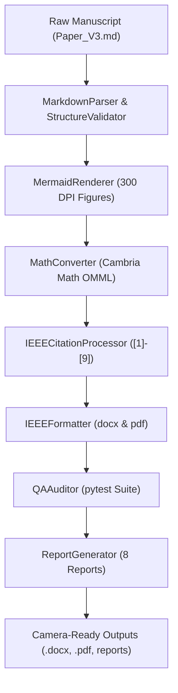

# AUTOMATED PUBLICATION PIPELINE ARCHITECTURE

**System**: Production-Grade Research Paper Formatting & Publication Pipeline  
**Version**: `1.0.0`  
**Standard**: IEEE Access & IMRaD Publishing Specification  

---

## 1. System Overview

The **Automated Publication Pipeline** (`paper_pipeline/`) is a modular, production-grade Python architecture that converts raw research manuscripts into camera-ready IEEE journal submission artifacts (`.docx` and `.pdf`).

---

## 2. Component Modules

1. **Parser (`paper_pipeline/parser`)**: Extracts section hierarchy, headers, lists, math expressions, and metadata.
2. **Validator (`paper_pipeline/validator`)**: Verifies IMRaD structural ordering and mandatory sections.
3. **Renderer (`paper_pipeline/renderer`)**: Detects Mermaid blocks and renders 300 DPI high-resolution figures.
4. **Equations (`paper_pipeline/equations`)**: Converts LaTeX math formulas into native Word equation objects.
5. **Citation (`paper_pipeline/citation`)**: Enforces IEEE numbered citation style (`[1]`, `[2]`, ...).
6. **Quality Assurance (`paper_pipeline/quality`)**: Automated QA auditor verifying zero raw Mermaid, zero raw LaTeX, and valid table borders.
7. **Reports (`paper_pipeline/reports`)**: Generates 8 automated compliance, audit, and validation reports.
