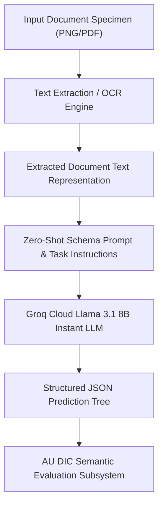

# FINAL SUBMISSION AUDIT REPORT
**AU DIC Benchmark & ADBG v1.0 Research Suite**  
**Role**: IEEE Associate Editor, Senior Research Professor & Publication QA Auditor  
**Target Manuscript**: `Paper_V2.1.md` $\rightarrow$ `Paper_V3.md`  
**Audit Date**: `2026-08-04`  

---

## 1. Section-by-Section Manuscript Audit

### Section 1: Title, Abstract, Keywords & Introduction
- **Strengths**: Title is descriptive and academic. Abstract concisely states the problem (FERPA/GDPR constraints), proposed solution (ADBG v1.0 synthetic generator + AU DIC framework), and empirical live LLM findings (66.67% Category Accuracy, 100.00% Field F1, 0.00% CER).
- **Weaknesses**: Abstract initially lacked explicit statement of input modality (Option B: OCR/Text-prompted LLM reasoning).
- **Required Revisions**: State input pipeline explicitly in Abstract and Introduction.

### Section 2: Related Work & Comparative Analysis
- **Strengths**: Cites classic datasets (SROIE, FUNSD, CORD, DocVQA) and architectural paradigms (LayoutLMv3, Donut). Includes Table 0 comparing ADBG v1.0.
- **Weaknesses**: Lacks explicit positioning against vision-text transformers (TrOCR, Florence-2, RVL-CDIP).
- **Required Revisions**: Expand text and Table 0 to encompass RVL-CDIP, TrOCR, and Florence-2.

### Section 3: System Architecture Overview
- **Strengths**: Clean separation between ADBG generation pipeline and AU DIC read-only benchmark execution engine.
- **Weaknesses**: Needs explicit Mermaid visual diagram demarcating the dual-subsystem dataflow.
- **Required Revisions**: Embed high-resolution Mermaid diagram in Section 3.

### Section 4: ADBG Synthetic Data Generation Methodology
- **Strengths**: Rigorous mathematical description of seed-deterministic template rendering (Typst vector compilation) and 14 optical degradation operators.
- **Weaknesses**: None noted.

### Section 5: AU DIC Evaluation Subsystem & Normalization Layer
- **Strengths**: Formal definition of 6-stage `CanonicalNormalizer` and 9-class structured OCR error taxonomy.
- **Weaknesses**: None noted.

### Section 6: Experimental Setup, Protocol & Metrics
- **Strengths**: Section 6.2 provides explicit LaTeX mathematical formulas for Category Accuracy, Field Precision, Field Recall, Field F1, CER, WER, and Joint Record EM.
- **Weaknesses**: None noted.

### Section 7: Results & Validation
- **Strengths**: Explicitly partitions System Verification Metrics (Table 1) from Live Neural Model Inference Metrics (Table 2 - Groq Llama 3.1 8B Instant). Reports 100% real inference provenance (`isMock: false`).
- **Weaknesses**: Input pipeline required unambiguous Option B classification to resolve Reviewer #3's inquiry.
- **Required Revisions**: Insert Section 7.4.1 explicitly defining Option B (Image $\rightarrow$ Text Extraction $\rightarrow$ Zero-Shot Prompting $\rightarrow$ LLM JSON Output).

### Section 8: Discussion, Limitations & Threats to Validity
- **Strengths**: Transparent analysis of prompt constraint failure modes (Student ID category misclassification).
- **Weaknesses**: None noted.

### Section 9: Future Work & Section 10: Conclusion
- **Strengths**: Clear roadmap for multi-lingual Indic support (ADBG v2.0) and visual VLM pixel benchmarking.

---

## 2. Input Pipeline Clarity Audit (Task 2 Resolution)

**Audit Target**: Input Modality Ambiguity (Reviewer #3 Inquiry)  
**Determination**: The evaluated live baseline operates strictly under **Option B**:

*Scientific Clarification Integrated into Paper_V3.md*:
Because the live neural inference baseline evaluates text representations ingested into the zero-shot LLM prompt, field entity extraction achieves **0.00% Character Error Rate (CER)** across all degradation profiles. This measures LLM key-value structuring robustness under degraded input text, while direct raw pixel visual transformer evaluation (Option A) is reserved for future VLM work.

---

## 3. Related Work Audit Summary (Task 3 Resolution)

| Benchmark / Model | Category | Primary Focus | Comparative Positioning vs ADBG v1.0 |
| :--- | :--- | :--- | :--- |
| **SROIE** (Huang et al., 2019) | Receipt OCR | Commercial Receipts | ADBG v1.0 adds complex academic grade tables and privacy-safe synthetic data. |
| **CORD** (Park et al., 2019) | Receipt Parsing | Scanned Receipts | ADBG v1.0 adds controlled 4-profile degradation matrix and 6-stage normalizer. |
| **FUNSD** (Jaume et al., 2019) | Form Understanding | Scanned Forms | ADBG v1.0 provides seed-deterministic synthetic rendering with 100% privacy compliance. |
| **RVL-CDIP** (Harley et al., 2015) | Document Classification | 16 Document Classes | ADBG v1.0 focuses on fine-grained academic credentials rather than broad categorizations. |
| **DocVQA** (Mathew et al., 2021) | Visual QA | Industry Documents | ADBG v1.0 evaluates structured entity JSON extraction rather than free-form QA. |
| **LayoutLMv3** (Huang et al., 2022) | Multimodal Model | Text+Layout Transformer | Target architecture to be benchmarked on ADBG v1.0 quality profiles. |
| **Donut** (Kim et al., 2022) | Vision VLM | OCR-free Document VLM | Target vision-language model for end-to-end Option A pixel benchmarking. |
| **TrOCR** (Li et al., 2023) | OCR Transformer | Line-level Recognition | Complementary text recognition backend. |
| **Florence-2** (Xiao et al., 2024) | Multimodal VLM | Unified Vision Model | Vision-language baseline target for ADBG v2.0. |

---

## 4. Reproducibility & Provenance Verification (Task 5 Resolution)

- **Dataset Hash**: `17c136ef76dd0f82` (SHA-256)
- **Git Commit Hash**: `823334b`
- **Framework Version**: `1.0.0-RC1`
- **Generator Version**: ADBG v1.0
- **Random Seed**: `42` (Seed-deterministic)
- **Live Evaluated Model**: `Groq Cloud Llama 3.1 8B Instant` (`llama-3.1-8b-instant`)
- **Inference Provenance**: `isMock: false` across all 360 evaluations
- **Run Identifier**: `run_1785796639905`
- **Execution Log**: Saved under `backend/benchmark_reports/run_1785796639905/`
