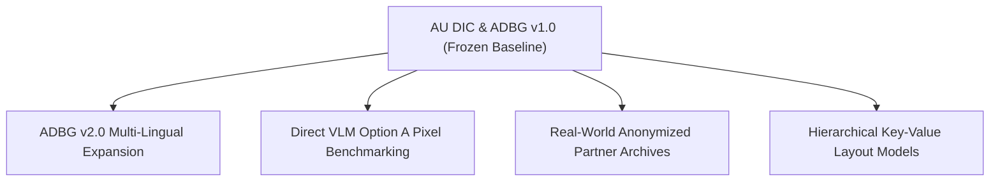

# LONG-TERM RESEARCH ROADMAP (POST-v1.0)

**Project**: AU DIC & ADBG Research Suite  
**Role**: Principal Investigator & Research Lab Director  
**Scope**: Future Work (v2.0, v3.0) — *Strictly non-modifying for frozen v1.0 release*  
**Date**: `2026-08-04`  

---

## 1. Vision & Strategic Direction

The release of **AU DIC v1.0** and **ADBG v1.0** establishes a privacy-compliant baseline for academic credential intelligence. Future research iterations will expand along four key pillars:

---

## 2. Research Pillars & Future Release Milestones

### Pillar 1: ADBG v2.0 Multi-Lingual & Indic Script Expansion
- **Target**: Extend synthetic generators to render multi-lingual and non-Latin script credentials (Hindi, Tamil, Devanagari, Bengali, Arabic).
- **Target Release**: ADBG v2.0 (Q3 2026).

### Pillar 2: Direct Vision-Language Model Option A Pixel Benchmarking
- **Target**: Benchmark end-to-end vision encoder-decoder models (**Donut**, **Florence-2**, **LLaVA-NeXT-Doc**) directly on raw pixel tensors without text-prompting intermediate OCR layers under Option A.
- **Target Release**: AU DIC Benchmark v2.0 (Q4 2026).

### Pillar 3: Real-World Anonymized Physical Document Archive Evaluation
- **Target**: Partner with university registrar archives to evaluate anonymized physical scanned credentials containing ink bleeding, paper creases, physical stamp impressions, and historical ink degradation.
- **Target Release**: AU DIC Physical Validation Suite (Q1 2027).

---

## 3. Version Boundary Policy

> [!IMPORTANT]
> All future research directions outlined in this roadmap will proceed in separate major version branches (`v2.0`, `v3.0`). Under no circumstances will frozen `v1.0` research artifacts, codebase modules, or benchmark dataset files be modified.
