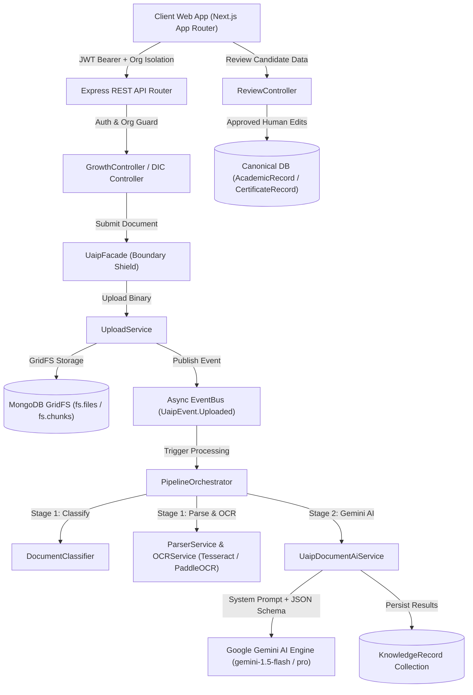
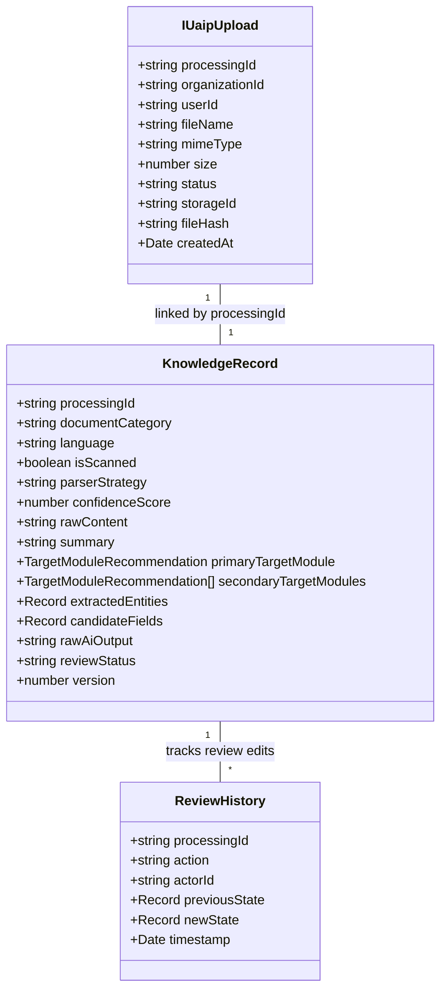

# AU DIC — Architecture Review Report (Sprint 001)

**Role**: Lead Software Architect, Principal AI Engineer, Principal Backend Engineer, Principal ML Evaluation Engineer, Principal Software Quality Engineer & Principal Research Engineer  
**Status**: APPROVED ARCHITECTURE AUDIT  
**Date**: August 4, 2026  

---

## Executive Summary

This Architecture Review Report provides an empirical, implementation-derived audit of the **Academic Universe Document Intelligence Center (AU DIC)** system prior to constructing the **AU DIC Benchmark Evaluation Framework**. 

The **Academic Document Benchmark Generator (ADBG v1.0)** is complete, verified, and frozen. It acts as an immutable downstream dependency providing standard benchmark datasets (`AU_DIC_Benchmark_v1.0`). This audit analyzes the current AU DIC production pipeline, data models, AI extraction stack, API contracts, code quality smells, and defines the architectural blueprint for the evaluation framework across Sprints 001–005.

---

## 1. High-Level System Architecture

The AU DIC platform operates as a multi-tenant, cloud-native Document AI and Academic Growth tracking system:



### Architectural Tiers
1. **Frontend Architecture**: Built using **Next.js (App Router)**, React 19, TypeScript, Tailwind CSS, and Shadcn UI components (`app/dashboard/student/document-intelligence/page.tsx`, `components/GrowthUploadPanel.tsx`). Communicates with backend endpoints via centralized `reviewApi.ts` client.
2. **Backend Architecture**: Built with **Express.js**, Node.js, and TypeScript (`backend/src/index.ts`, `backend/src/routes/index.ts`). Modular structure with domain controllers, services, repositories, and event-driven pipeline execution.
3. **API Layer**: RESTful JSON HTTP endpoints mounted under `/api/document-intelligence/*`, `/api/growth/*`, and `/api/review/*`.
4. **Authentication & Tenant Security**: `authenticateUser` middleware extracts JWT bearer tokens; `enforceOrgIsolation` binds all queries to `organizationId`; `authorize()` enforces role permissions (`STUDENT`, `FACULTY`, `ADMIN`, `SUPER_ADMIN`).
5. **Database**: **MongoDB** with Mongoose ORM (`UaipUpload`, `KnowledgeRecord`, `ReviewHistory`, `AcademicRecord`, `CertificateRecord`).
6. **Storage Engine**: **MongoDB GridFS** (`GridFSProvider`) storing binary source documents (PDFs, images) and thumbnail previews.
7. **AI & Pipeline Execution**: **Universal Academic Intelligence Pipeline (UAIP)**. Decoupled via `EventBus` (`UaipEvent.Uploaded`). Combines Stage 1 local rule/OCR parsing with Stage 2 Google Gemini AI structured extraction.

---

## 2. Document Processing Pipeline Workflow

Derived directly from `PipelineOrchestrator` (`backend/src/services/pipeline-orchestrator.ts`) and `UaipDocumentAiService` (`backend/src/shared/application/UaipDocumentAi.service.ts`):

```text
Upload Submission (POST /api/growth/documents)
  ↓
1. Binary Storage & Event Emission
   - UploadService stores file buffer in GridFS (obtains storageId).
   - Persists UaipUpload record (status: PENDING, unique processingId).
   - Emits UaipEvent.Uploaded event asynchronously onto EventBus.
  ↓
2. Pipeline Orchestration Trigger
   - PipelineOrchestrator receives UaipEvent.Uploaded.
   - Atomically transitions UaipUpload status to PROCESSING.
   - Fetches file binary buffer from GridFS.
  ↓
3. Stage 1: Document Classification & Local Parsing
   - DocumentClassifier checks MIME, file magic bytes, and keywords.
   - Assigns documentCategory (CERTIFICATE, MARKSHEET, TRANSCRIPT, RESUME, etc.) and isScanned flag.
   - ParserService runs PDF parser (PdfTextExtractor) or triggers OCRService if scanned/image.
   - OCRService executes Tesseract.js / PaddleOCR sidecar and caches raw text.
  ↓
4. Stage 2: Gemini AI Intelligence & Structured Extraction
   - Evaluates if Stage 2 AI processing is needed (UNKNOWN category, confidence < threshold, or semantic doc).
   - UaipDocumentAiService loads raw parsed text/OCR content from KnowledgeRecord.
   - Generates strict system instruction prompt enforcing zero-hallucination rules and JSON schema.
   - Calls Google Gemini API (temperature=0.2, maxTokens=8192).
   - Validates JSON response structure, grade constraints, and category completeness.
   - Executes ModuleRoutingEngine to recommend primary and secondary target modules.
  ↓
5. Knowledge Record Persistence
   - Updates KnowledgeRecord with category, confidence, candidateFields, extractedEntities, routingDecision, and reviewStatus = 'PENDING_REVIEW'.
   - Transitions UaipUpload status to SUCCESS.
  ↓
6. Human-in-the-Loop Review & Canonical Commit
   - Reviewer views candidate data via GET /api/review/:processingId.
   - Submits approved edits via POST /api/review/:processingId/approve.
   - Human-reviewed fields are written atomically to canonical collections (e.g. AcademicRecord). AI never writes directly to canonical DB.
```

---

## 3. OCR & AI Stack Analysis

### OCR Component Stack
- **Engine 1**: `TesseractEngine` (`tesseract.js` node wrapper for local CPU OCR).
- **Engine 2**: `PaddleOcrEngine` (HTTP client targeting a Python FastAPI PaddleOCR sidecar for dense layout OCR).
- **PDF Extractor**: `PdfTextExtractor` (`pdf-parse` library for native text vector PDFs).
- **Preprocessing Layer**: `SharpImagePreprocessor` (`sharp` library providing grayscale conversion, Otsu binarization, contrast adjustment, and resolution scaling).

### Gemini AI Stack
- **Provider Core**: `aiProvider` wrapping Google Generative AI SDK (`@google/genai` / `@google/generative-ai`).
- **Model Target**: Gemini 1.5 Flash / Gemini 1.5 Pro.
- **Prompt Engineering**:
  - Direct system instructions enforcing exact literal text extraction.
  - Zero-hallucination constraints: missing fields must be `null` or `""`.
  - Disambiguation rules for `totalCredits` vs subject `credits`.
  - Term vs Semester distinction rules (Term 1/2 are academic sessions, not degree semesters).
  - Explicit grade validation rules (Allowed grades: `O`, `A+`, `A`, `B+`, `B`, `C`, `P`, `F`, `Qualified`, `Audit`).
  - Grade point disambiguation strategy (e.g. distinguishing `O` [10 pts] vs `C` [5 pts] using grade points and credits formula).
- **Structured Output Parser**: `validateAiResponse()` method validates JSON object properties, floats, module array IDs, grade string sets, and fallback regex entity extractors for certificates.
- **Error Handling**: Log checkpoints, fallback `rawAiOutput` error JSON persistence, and non-blocking pipeline error states.

---

## 4. API Endpoint Analysis

| Endpoint Route | HTTP Method | Request Body / Params | Response Structure | Dependencies | Current Limitations |
| :--- | :---: | :--- | :--- | :--- | :--- |
| `/api/growth/documents` | `POST` | `multipart/form-data` (`file`) | `{ success, data: { processingId } }` | `UaipFacade`, `UploadService`, `GridFSProvider`, `EventBus` | Fixed 10MB upload ceiling; synchronous buffer loading in memory. |
| `/api/document-intelligence/documents` | `GET` | Query: `status`, `category`, `search`, `sortBy`, `limit`, `cursor` | `{ success, data: { documents[], nextCursor } }` | `DocumentIntelligenceService`, `KnowledgeRecordModel` | In-memory cursor pagination; limited aggregate search indexes. |
| `/api/document-intelligence/documents/:processingId` | `GET` | Path: `processingId` | `{ success, data: KnowledgeRecordDetail }` | `DocumentIntelligenceService` | High payload size when returning large raw text logs. |
| `/api/document-intelligence/analytics` | `GET` | None | `{ success, data: { totalDocuments, categoryCounts, statusCounts, avgConfidence } }` | `DocumentIntelligenceService` | Computes aggregate counts on read; not cached. |
| `/api/document-intelligence/documents/:processingId` | `DELETE` | Path: `processingId` | `{ success, data: { outcome: 'SUCCESS' } }` | `DocumentIntelligenceService` | Blocks deletion if canonical records already exist without prior rollback. |
| `/api/document-intelligence/documents/review-required` | `DELETE` | Query/Body: None | `{ success, data: { successfullyDeleted: N } }` | `DocumentIntelligenceService` | Scoped to org; sequential bulk soft-delete loop. |
| `/api/review/:processingId` | `GET` | Path: `processingId` | `{ success, data: { candidateFields, reviewStatus, version } }` | `ReviewController`, `KnowledgeRecordModel` | None. |
| `/api/review/:processingId/draft` | `POST` | Body: `{ editedFields: {} }` | `{ success, data: { version, reviewStatus } }` | `ReviewController` | Overwrites draft object; increments integer version. |
| `/api/review/:processingId/approve` | `POST` | Body: `{ editedFields?: {} }` | `{ success, data: { canonicalRecordIds[] } }` | `ReviewController`, `AcademicRecordModel`, `CertificateRecordModel` | Requires human session; cannot be executed headlessly by AI. |
| `/api/review/:processingId/rollback` | `POST` | Path: `processingId` | `{ success, data: { revertedStatus: 'PENDING_REVIEW' } }` | `ReviewController`, `ReviewHistoryModel` | Reverts DB state; leaves orphaned audit logs. |

---

## 5. Data Model Architecture



---

## 6. Current Output Contract (AI Prediction JSON)

When AU DIC processes a document, `UaipDocumentAiService` yields the following exact JSON structure:

```json
{
  "documentCategory": "MARKSHEET",
  "confidenceScore": 0.96,
  "summary": "Semester 4 Bachelor of Technology Marksheet for Student Aashish Rajput from Sharda University.",
  "extractedEntities": {
    "studentName": "Aashish Rajput",
    "rollNumber": "2021001234",
    "institution": "Sharda University",
    "term": "Term 2",
    "academicYear": 2024,
    "gpa": 8.85,
    "totalCredits": 24.0
  },
  "suggestedModule": "AcademicRecord",
  "primaryTargetModule": {
    "id": "academic-records",
    "name": "Academic Records",
    "confidence": 0.96,
    "reason": "Document contains subject codes, grades, and semester GPA details."
  },
  "secondaryTargetModules": [],
  "candidateFields": {
    "subjects": [
      {
        "code": "CSE201",
        "name": "Data Structures & Algorithms",
        "credits": 4.0,
        "gradingStatus": "Graded",
        "grade": "A+",
        "gradePoints": 36.0,
        "term": "Term 2",
        "academicYear": 2024
      },
      {
        "code": "CSE202",
        "name": "Database Management Systems",
        "credits": 4.0,
        "gradingStatus": "Graded",
        "grade": "O",
        "gradePoints": 40.0,
        "term": "Term 2",
        "academicYear": 2024
      }
    ],
    "gpa": 8.85,
    "totalCredits": 24.0
  }
}
```

---

## 7. Benchmark Integration Analysis

### Integration Strategy
The **ADBG v1.0** dataset contains:
- `pdf/clean/{certificates, marksheets, student_ids}/`: Vector source PDFs.
- `images/{profile}/{format}/{category}/`: 360 PNG and 360 JPEG image files across 4 quality profiles (`clean`, `scanner_copy`, `mobile_camera`, `rotated_90`).
- `groundtruth/{profile}/{category}/`: 360 JSON ground truth files detailing document labels, bounding boxes, and field values.
- `metadata/{profile}/{category}/`: 360 metadata JSON files.

### Component Reuse vs. Required Adapters
1. **Reusable AU DIC Components**: `UaipDocumentAiService`, `DocumentClassifier`, `ParserService`, `OCRService`, `SharpImagePreprocessor`, `validateAiResponse()`.
2. **Required Adapter 1 (`AdbgGroundTruthAdapter`)**: Parses ADBG ground truth JSON files and converts them into standardized ground truth schemas (`BenchmarkGroundTruth`).
3. **Required Adapter 2 (`AuDicPredictionAdapter`)**: Feeds ADBG PDF/image files through AU DIC pipeline, captures output JSON (`candidateFields` / `extractedEntities`), and normalizes them into `BenchmarkPrediction`.
4. **Required Metric Engine (`BenchmarkMetricsEngine`)**: Computes Character Error Rate (CER), Word Error Rate (WER), Field Exact Match (EM), Normalized Levenshtein Similarity, Field-Level Precision / Recall / F1 Score, and Category Classification Accuracy.

---

## 8. Code Quality Audit

1. **Monolithic Service Violation (Single Responsibility Principle)**: `UaipDocumentAiService` handles prompt construction, AI HTTP execution, JSON schema validation, regex fallback extraction, grade point logic, and Mongoose database updates in a single file.
2. **Dual Category / Route Abstractions**: Legacy `suggestedModule` string (`"AcademicRecord"`) coexists alongside `primaryTargetModule` object (`{ id: "academic-records" }`), creating potential mapping confusion.
3. **In-Memory Buffer Allocation**: `PipelineOrchestrator` fetches complete GridFS binary buffers into V8 heap memory before passing to classifiers and parsers. Large batch processing risks heap exhaustion.
4. **Synchronous OCR Blocking**: `OCRService.waitForOcr()` polls or waits synchronously inside pipeline execution, creating potential event-loop delay under high batch loads.

*(Note: In accordance with Sprint 001 rules, no source code fixes or refactoring have been executed during this analysis phase.)*

---

## 9. Proposed Benchmark Evaluation Module Architecture

To evaluate AU DIC clean datasets headlessly without modifying existing production routes, we propose a self-contained, modular **AU DIC Benchmark Evaluation Module**:

```text
backend/src/modules/benchmark/  (or top-level benchmark/)
├── adapters/
│   ├── AdbgGroundTruthAdapter.ts    # Transforms ADBG GT JSONs -> BenchmarkGroundTruth
│   └── AuDicPredictionAdapter.ts   # Invokes AU DIC Pipeline -> BenchmarkPrediction
├── comparators/
│   ├── ExactMatchComparator.ts      # Literal value equality
│   ├── StringDistanceComparator.ts  # Levenshtein Edit Distance (CER / WER)
│   ├── NumericFieldComparator.ts    # GPA, credits, marks tolerance matching
│   └── SubjectArrayComparator.ts    # Per-subject row-level evaluation
├── evaluators/
│   ├── CategoryEvaluator.ts        # Classification accuracy & confusion matrix
│   ├── FieldLevelEvaluator.ts       # Precision, Recall, F1 per field
│   ├── GradeIntegrityEvaluator.ts   # Robustness of grade & gradePoints extraction
│   └── ProfileRobustnessEvaluator.ts# Performance drop across Clean vs Scanner vs Mobile vs Rotated 90
├── metrics/
│   ├── MetricCalculator.ts          # Aggregate CER, WER, F1, Accuracy metrics
│   └── MetricTypes.ts               # Metric domain interfaces
├── runner/
│   ├── BenchmarkRunner.ts           # Batch evaluation orchestrator
│   └── ExecutionConfig.ts           # Parallelism, profile filters, seed settings
├── reports/
│   ├── JsonReportGenerator.ts       # Structured JSON evaluation results
│   ├── MarkdownReportGenerator.ts   # Publication-ready Markdown summary
│   └── LatexTableGenerator.ts       # IEEE / Scopus ready LaTeX table generator
└── visualizations/
    ├── ConfusionMatrixPlotter.ts    # Visual matrix generation
    └── DegradationCurveGenerator.ts # Profile accuracy decay curves
```

---

## 10. Sprint Implementation Roadmap (Sprints 001–005)

### Sprint 001: Architecture Audit & Benchmark Foundation
- **Objectives**: Complete system audit (Done), define benchmark interfaces, ground truth parser, prediction adapter, and core metric types (CER/WER/EM).
- **Deliverables**: Architecture Review Report, `BenchmarkGroundTruth` & `BenchmarkPrediction` interfaces, `AdbgGroundTruthAdapter`.
- **Validation**: Unit tests verifying ground truth parsing against ADBG v1.0 samples.

### Sprint 002: Field-Level Extraction Evaluators & Normalizers
- **Objectives**: Implement field-specific comparators (Exact Match, Levenshtein Distance, Numeric Tolerance, Subject Array Matcher) and Category Evaluator.
- **Deliverables**: `StringDistanceComparator`, `SubjectArrayComparator`, `CategoryEvaluator`, `FieldLevelEvaluator`.
- **Validation**: Test suite verifying exact match vs fuzzy match on ground truth test vectors.

### Sprint 003: Quality Profile Degradation & Robustness Evaluation
- **Objectives**: Evaluate AU DIC performance across all 4 quality profiles (`clean`, `scanner_copy`, `mobile_camera`, `rotated_90`). Measure accuracy degradation penalties.
- **Deliverables**: `ProfileRobustnessEvaluator`, `GradeIntegrityEvaluator`, degradation impact metrics.
- **Validation**: Comparative benchmark run over 360 image variants in `AU_DIC_Benchmark_v1.0`.

### Sprint 004: Automated Batch Runner & Multi-Format Reporting Suite
- **Objectives**: Build CLI benchmark runner with batch concurrency, JSON exporter, Markdown summary builder, and IEEE LaTeX table generator.
- **Deliverables**: `BenchmarkRunner`, `JsonReportGenerator`, `MarkdownReportGenerator`, `LatexTableGenerator`.
- **Validation**: Full end-to-end benchmark execution producing `benchmark_results.json` and IEEE manuscript tables.

### Sprint 005: IEEE / Scopus Publication Integration & Final Certification
- **Objectives**: Generate final publication figures, confusion matrices, performance decay charts, complete manuscript tables, and produce final evaluation certificate.
- **Deliverables**: Publication figures, LaTeX tables, complete evaluation dataset report, research paper integration.
- **Validation**: 100% test pass rate, reproducible benchmark numbers, zero manual edits.

---

## Architectural Sign-Off

This Architecture Review Report completes the **Sprint 001 Analysis Phase**. All findings are derived directly from empirical codebase inspection. Production code implementation for Sprint 001 framework components will commence upon user review and approval.
